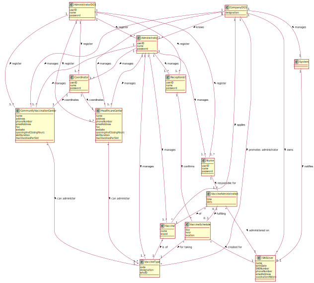

# OO Analysis #

The construction process of the domain model is based on the client specifications, especially the nouns (for _concepts_) and verbs (for _relations_) used.

## Rationale to identify domain conceptual classes ##
To identify domain conceptual classes, start by making a list of candidate conceptual classes inspired by the list of categories suggested in the book "Applying UML and Patterns: An Introduction to Object-Oriented Analysis and Design and Iterative Development".

### _Conceptual Class Category List_ ###

**Business Transactions**

* Vaccine Administration

---

**Transaction Line Items**

*  

---

**Product/Service related to a Transaction or Transaction Line Item**

*  Vaccine

---

**Transaction Records**

*  

---  

**Roles of People or Organizations**

* SNS User
* Receptionist
* Nurse
* Administrator
* Coordinator
* DGS Administrator

---

**Places**

* Community Vaccination Center
* Healthcare Center
---

**Noteworthy Events**

* Vaccine Schedule
* Vaccine Administration
---

**Physical Objects**

* Vaccine

---

**Descriptions of Things**

* Vaccine Type

---

**Catalogs**

*  

---

**Containers**

*  

---

**Elements of Containers**

*  

---

**Organizations**

* DGS
* WHO

---

**Other External/Collaborating Systems**

*  

---

**Records of finance, work, contracts, legal matters**

*  

---

**Financial Instruments**

*  

---

**Documents mentioned/used to perform some work/**

*  SNS user file
---

### _Rationale to identify associations between conceptual classes_ ###

An association is a relationship between instances of objects that indicates a relevant connection and that is worth of remembering, or it is derivable from the List of Common Associations:

+ **_DGS_** manages **_Administrator_**
+ **_DGS_** manages **_Healthcare Center_**
+ **_DGS_** manages **_Community Vaccination Center_**
+ **_DGS_** manages **_System_**
+ **_DGS_** applies **_Vaccine_**
+ **_DGS_** owns **_SNS User_**
+ **_Administrator_** manages **_Healthcare Center_**
+ **_Administrator_** manages **_Community Vaccination Center_**
+ **_Administrator_** manages **_Vaccine_**
+ **_Administrator_** manages **_Vaccine Type_**
+ **_Administrator_** manages **_Receptionist_**
+ **_Administrator_** manages **_Nurse_**
+ **_Administrator_** manages **_Coordinator_**
+ **_DGS Administrator_** registers **_Healthcare Center_**
+ **_DGS Administrator_** registers **_Community Vaccination Center_**
+ **_DGS Administrator_** registers **_Receptionist_**
+ **_DGS Administrator_** registers **_Nurse_**
+ **_DGS Administrator_** registers **_Coordinator_**
+ **_DGS Administrator_** registers **_Administrator_**
+ **_Vaccine Administration_** is of **_Vaccine_**
+ **_Vaccine Administration_** fulfills **_Vaccine Schedule_**
+ **_Vaccine Administration_** is administered on **_SNS User_**
+ **_Vaccine Schedule_** is for taking **_Vaccine Type_**
+ **_Vaccine Schedule_** is created for **_SNS User_**
+ **_Healthcare Center_** can administer **_Vaccine_**
+ **_Healthcare Center_** can administer **_Vaccine_**
+ **_Receptionist_** confirms **_Vaccine Schedule_**
+ **_Nurse_** is responsible for **_Vaccine Administration_**
+ **_Coordinator_** coordinates **_Community Vaccination Center_**
+ **_Coordinator_** coordinates **_Healthcare Center_**
+ **_Vaccine Type_** is a description for **_Vaccine_**
+ **_System_** notifies **_SNS User_**

  

| Concept (A) 		         |                         Association   	                          |                                                                                                                Concept (B) |
|------------------------|:----------------------------------------------------------------:|---------------------------------------------------------------------------------------------------------------------------:|
| DGS                    | manages manages manages manages applies owns |                  Administrator  Healthcare Center Community Vaccination Center System Vaccine SNS User |
| Administrator          |                             manages                              | Healthcare Center Community Vaccination Center Vaccine Vaccine Type Receptionist Nurse Coordinator |
| DGS Administrator      |                            registers                             |            Healthcare Center Community Vaccination Center Receptionist Nurse Coordinator Administrator |
| Vaccine Administration |        is of fulfills is administered on    		 	         |                                                                                  Vaccine Vaccine Schedule SNS User |
| Vaccine Schedule       |                 is for taking is created for                 |                                                                                                  Vaccine Type SNS User |
| Healthcare Center      |                      can administer    		 	                      |                                                                                                                    Vaccine |
| Receptionist           |                          confirms  		 	                          |                                                                                                           Vaccine Schedule |
| Nurse                  |                      is responsible for		 	                      |                                                                                                     Vaccine Administration |
| Coordinator            |                        coordinates   		 	                        |                                                                                               Community Vaccination Center |
| Vaccine Type           |                    is a description for  		 	                    |                                                                                                                    Vaccine |
| System                 |                          notifies  		 	                          |                                                                                                                   SNS User |

## Domain Model

**Do NOT forget to identify concepts attributes too.**

**Insert below the Domain Model Diagram in an SVG format**

