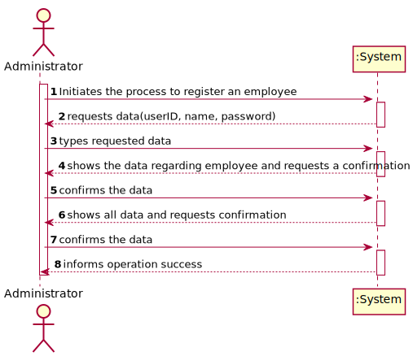
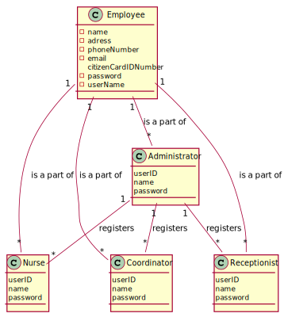
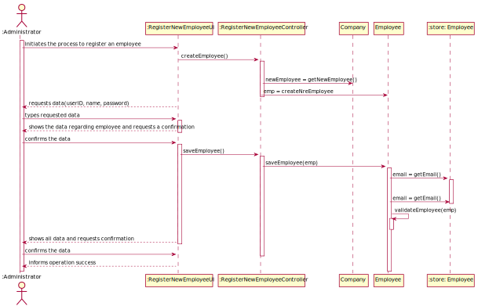
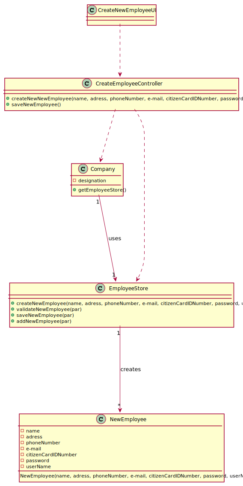

# US10 - Register an Employee

## 1. Requirements Engineering

### 1.1. User Story Description

As an administrator, I want to Register an Emplyee.

### 1.2. Customer Specifications and Clarifications 

* From the client clarifications:

    * >**Q:** "Besides a password and a user name, what other (if any) information should the Admin use to register a new employee? Are any of them optional?"

      > **A:** Every Employee has only one role (Coordinator, Receptionist, Nurse).
      Employee attributes: Id (automatic), Name, address, phone number, e-mail and Citizen Card number.
      All attributes are mandatory.

  
### 1.3. Acceptance Criteria

AC1 : Each user must have a single role defined in the system. The "auth" component available in the repository must be reused (without modifications).

### 1.4. Found out Dependencies
*No dependencies*

### 1.5 Input and Output Data

**Input Data**
+ Typed Data: name, adress, phoneNumber, e-mail, citizenCardIDNumber, password, userName
+ Selected Data: Employee

**Output Data**

**None**
### 1.6. System Sequence Diagram (SSD)

**Omitted / Not Provided.**

### 1.7 Other Relevant Remarks

**Omitted / Not Provided.**

## 2. OO Analysis

### 2.1. Relevant Domain Model Excerpt 

### 2.2. Other Remarks

**Omitted / Not Provided.**

## 3. Design - User Story Realization

### 3.1. Rationale

| Interaction ID | Question: Which class is responsible for...     | Answer                | Justification (with patterns)                                                                                 |
|:---------------|:------------------------------------------------|:----------------------|:--------------------------------------------------------------------------------------------------------------|
| Step 1 		      | 	... interacting with the actor?                | NewEmployeeUI         | Pure Fabrication: there is no reason to assign this responsibility to any existing class in the Domain Model. |
|                | ... coordinating the US?                        | NewEmployeeController | Controller                                                                                                    |
| Step 2  		     | 							                                         |                       |                                                                                                               |
| Step 3  		     | 	... allowing the selection of the new Employee | NewEmployeeUI         | Pure Fabrication: there is no reason to assign this responsibility to any existing class in the Domain Model. |
| Step 4  		     | 							                                         |                       |                                                                                                               |
| Step 5  		     | ... save the new NewEmployee                    | NewEmployeeStore      | IE: object created has its own data                                                                           |
|                | ... instantiating a new Laboratory?             | NewEmployeeStore      | Creator                                                                                                       |
| Step 6  		     | 							                                         |                       |                                                                                                               |              
| Step 7  		     | 	... validating all data (local validation)?	   | NewEmployee           | IE: owns its data.                                                                                            |              
| 		             | 	... validating all data (global validation)?   | NewEmployeeStore      | IE: knows all NewEmployees                                                                                    |              
| 		             | 	... saving the created task?						             | NewEmployeeStore      | IE: stores all NewEmployees                                                                                   |              
| Step 8  		     | 		... informing operation success?				          | NewEmployeeUI         | IE: is responsible for user interaction                                                                       |

## 3.2. Sequence Diagram (SD)
  

  
## 3.3. Class Diagram (CD)

# 4. Tests

**Test 1:** Check that it is not possible to create an instance of the Example class with  values that are null. 

	@Test(expected = IllegalArgumentException.class)
		public void ensureNullIsNotAllowed() {
		Exemplo instance = new Exemplo(null, null);
	}

# 5. Construction (Implementation)

##CreateNewEmployeeController

    public class CreateNewEmployeeController {

      private Company company;
      private newEmployee newEmployee;
      private newEmployeeStore newEmployeeStore;
      private newEmployeeCategoryStore newEmployeeCategoryStore ;

      public CreatenewEmployeeController() {
          this(App.getInstance().getCompany());
  
      }

      public CreatenewEmployeeController(Company company) {
          this.company = company;
          this.newEmployeeCategoryStore = company.getnewEmployeeCategoryStore();
          this.newEmployeeStore = company.getnewEmployeeStore();
      }

      public void createNewnewEmployee(String name, String adress,String phoneNumber, String e-mail, String citizenCardIDNumber, String password, String userName, String newEmployeeCategoryDescription){
          newEmployeeCategory category = newEmployeeCategoryStore.getnewEmployeeCategoryByDescription(newEmployeeCategoryDescription);
          if(category == null){ //cannot create a newEmployee without category....
              throw  new IllegalArgumentException("Category is null");
          }
  
          newEmployee = newEmployeeStore.createNewEmployee(name, adress, phoneNumber, e-mail, citizenCardIDNumber, password, userName);
          newEmployeeStore.validatenewEmployee(newEmployee);
      }

      public void saveNewEmployee(){
          newEmployeeStore.savenewEmployee(newEmployee);
      }

      public List<String> getnewEmployee{
          newEmployeeCategoryStore = company.getnewEmployeeCategoryStore();
          List<String> newEmployeeCategoryString = new ArrayList<>();
          for (newEmployeeCategory pc : newEmployeeCategoryStore.getnewEmployeeCategoryList()){
              newEmployeeCategoryString.add(pc.getDescription());
          }
          return newEmployeeCategoryString;
      }

    }

##NewEmployeeStore

    public class newEmployeeStore {

      private List<newEmployee> newEmployeeList;

      public newEmployeeStore(){
          newEmployeeList = new ArrayList<>();
      }

      public newEmployee createnewEmployee(String name, String adress, String phoneNumber, String e-mail, String citizenCardIDNumber, String password, String userName, newEmployeeCategory category){
          return new newEmployee(name, adress, phoneNumber, e-mail, citizenCardIDNumber, password, userName);
      }

      public void validatenewEmployee(newEmployee newEmployee){
          if (newEmployeeList.contains(newEmployee)){
              throw new IllegalArgumentException("The newEmployee has already been created.");
          }
      }

      public void savenewEmployee(newEmployee newEmployee){
          validatenewEmployee(newEmployee);
          addnewEmployee(newEmployee);
      }

      public void addnewEmployee(newEmployee newEmployee){
          newEmployeeList.add(newEmployee);
      }
    }

# 5. Construction (Implementation)

**Omitted / Not Provided.**

# 6. Integration and Demo 

**Omitted / Not Provided.**

# 7. Observations

* Some methods have more parameters than usual. The use of DTOs can solve this issue *

