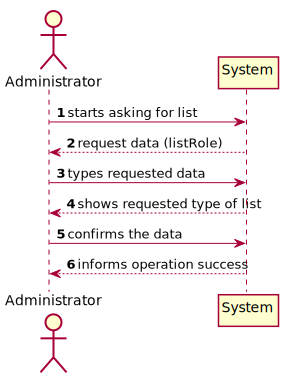
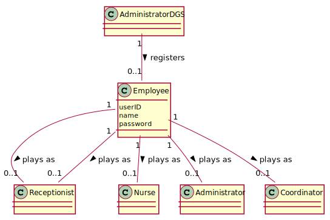
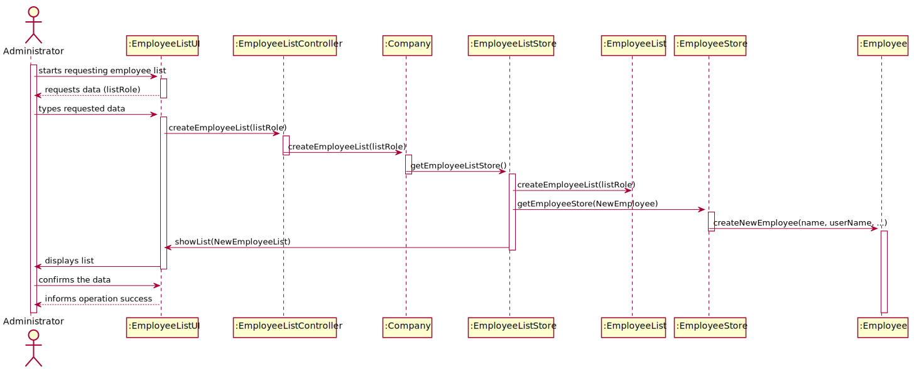
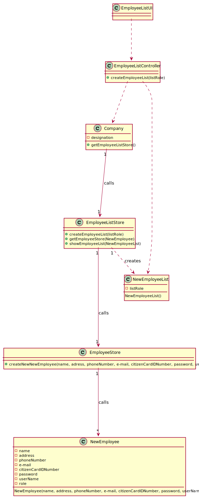

# US11 - Employee List

## 1. Requirements Engineering

### 1.1. User Story Description

As an administrator, I want to get a list of Employees with a given function/role.

### 1.2. Customer Specifications and Clarifications 

+ The application should present all Employee attributes, with the exception of passwords.
+ The Administrator should select a given role and all employees associated with the selected role should be listed.
+ The order in which the Employees are listed is not important.  

### 1.3. Acceptance Criteria

**Omitted / Not Provided.**

### 1.4. Found out Dependencies

*Dependent on US10 "As an administrator, I want to register an Employee."*

### 1.5 Input and Output Data

**Input Data**
+ Typed Data: listRole
+ Selected Data: NewEmployee()

**Output Data**
+ showEmployeeList()

### 1.6. System Sequence Diagram (SSD)

### 1.7 Other Relevant Remarks

**Omitted / Not Provided.**

## 2. OO Analysis

### 2.1. Relevant Domain Model Excerpt 

### 2.2. Other Remarks

**Omitted / Not Provided.**

## 3. Design - User Story Realization

### 3.1. Rationale

**Omitted / Not Provided.**

## 3.2. Sequence Diagram (SD)
  

  
## 3.3. Class Diagram (CD)

# 4. Tests 

**Omitted / Not Provided.**

# 5. Construction (Implementation)

**Omitted / Not Provided.**

# 6. Integration and Demo 

**Omitted / Not Provided.**

# 7. Observations

**Omitted / Not Provided.**

