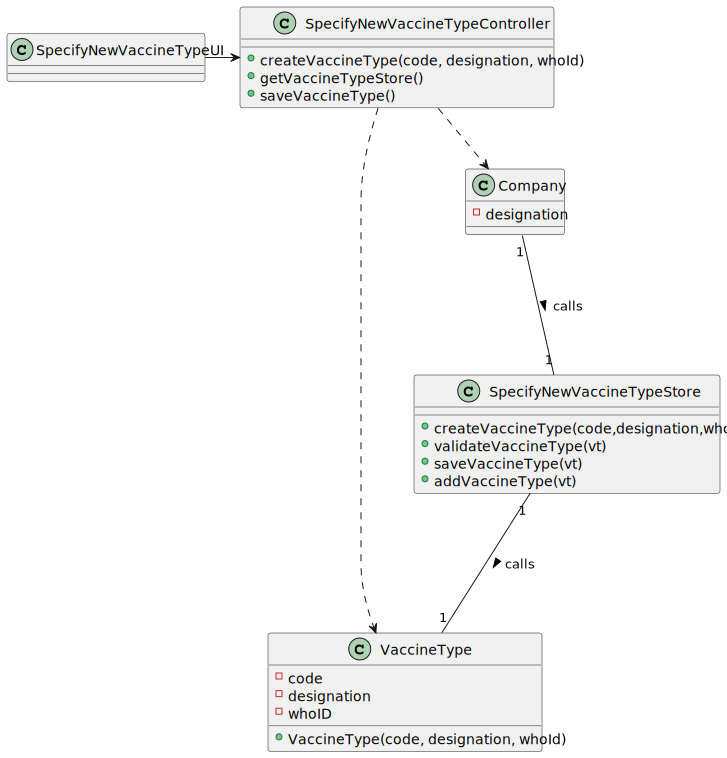

# US 12 - Create Vaccine Type

## 1. Requirements Engineering

*In this section, it is suggested to capture the requirement description and specifications as provided by the client as well as any further clarification on it. It is also suggested to capture the requirements acceptance criteria and existing dependencies to other requirements. At last, identify the involved input and output data and depicted an Actor-System interaction in order to fulfill the requirement.*

### 1.1. User Story Description

*As an administrator, I intend to specify a new vaccine type.*

### 1.2. Customer Specifications and Clarifications
From the Specifications Document:
- “[…] the community mass vaccination centers are facilities specifically created to administer vaccines of a single type […]”
- “[…] healthcare center […] can administer any type of vaccines (e.g.: Covid-19, Dengue, Tetanus, smallpox).”
- “[…] for each type of vaccine, it might exist several vaccines […]”
- “[…] The nurse checks the user info and health conditions in the system and in accordance with.”
- “[…] After giving the vaccine to the user, each nurse registers the event in the system more precisely, registers the vaccine type.”the scheduled vaccine type."

From the client clarifications:
- Question: What are the data that characterize a parameter category?
- Answer: Simply consider a code, a designation and an WHO identifier
- Question: What are the business rules applicable to such data?
- Answer: …
- Question: "What is the size and requirements of the WHO identifier?"
- Answer: We will not use the WHO identifier. The client did not introduce this attribute.
- Question: "What kind of information would you like to include in a new type of vaccine?"
- Answer:The vaccine type should have the following attributes: Code (five alphanumeric characters), Short description and Vaccine technology. Please check the web page above to identify the six types of vaccine technologies that can be selected. https://www.pfizer.com/news/articles/understanding_six_types_of_vaccine_technologies

### 1.3. Acceptance Criteria

- AC1: Code must be unique having 4 to 8 chars
- AC2: Designation cannot be empty and has, at maximum, 40 chars
- AC3: WHO identifier is not mandatory

### 1.4. Found out Dependencies

- No dependencies were found.

### 1.5 Input and Output Data

*Identity here the data to be inputted by the system actor as well as the output data that the system have/needs to present in order to properly support the actor actions. Regarding the inputted data, it is suggested to distinguish between typed data and selected data (e.g. from a list)*
- Typed data: code, designation and WHO identifier
- Selected data: (code, designation, WHO identifier)
- Output data: (In)Sucess of the operation performed

### 1.6. System Sequence Diagram (SSD)

### 1.7 Other Relevant Remarks

*Use this section to capture other relevant information that is related with this US such as (i) special requirements ; (ii) data and/or technology variations; (iii) how often this US is held.*

## 2. OO Analysis

### 2.1. Relevant Domain Model Excerpt
*In this section, it is suggested to present an excerpt of the domain model that is seen as relevant to fulfill this requirement.*

### 2.2. Other Remarks

*Use this section to capture some aditional notes/remarks that must be taken into consideration into the design activity. In some case, it might be usefull to add other analysis artifacts (e.g. activity or state diagrams).*

## 3. Design - User Story Realization

### 3.1. Rationale

**The rationale grounds on the SSD interactions and the identified input/output data.**

| Interaction ID                                                | Question: Which class is responsible for...                            | Answer                     | Justification (with patterns)                     |
|:--------------------------------------------------------------|:-----------------------------------------------------------------------|:---------------------------|:--------------------------------------------------|
| Step 1 - start specifying a new vaccine type  		              | 	Instantiating a new vaccine type						                                | SpecifyNewVaccineTypeStore | Creator: R1/2                                     |
| Step 2 - request data (code, designation and who identifier)	 | 	Requesting data to the user						                                     | SpecifyNewVaccineTypeUI    | IE: responsible for user interaction              |
| Step 3 - types requested data		                               | Saving the input data					                                             | VaccineType                | IE: The object created in step 1 has its own data |
| Step 4 - shows the data and requests a confirmation  		       | 	Validating the data locally	(eg: mandatory vs non-mandatory data)				 | VaccineType                | IE: knows its own data                            |
| 	                                                             | 	Validating the data globally (eg: duplicated data)						              | SpecifyNewVaccineTypeStore | IE: knows all the VaccineType objects             |
| Step 5 - confirms data                                        | 	Saving the created vaccine						                                      | SpecifyNewVaccineTypeStore | IE: adopts/records all the VaccineType objects    |
| Step 6 - informs operation success                            | 	Informing the operation success						                                 | SpecifyNewVaccineTypeUI    | IE: responsible for user interaction              |              

### Systematization ##

According to the taken rationale, the conceptual classes promoted to software classes are:

* SpecifyNewVaccineController
* CompanyDGS
* Vaccine
* VaccineType
* SpecifyNewVaccineTypeUI
* MenuVaccineType
* NewVaccineTypeUI

Other software classes (i.e. Pure Fabrication) identified:
* SpecifyNewVaccineTypeUI
* NewVaccineTypeUI
* SpecifyNewVaccineController

## 3.2. Sequence Diagram (SD)

*In this section, it is suggested to present an UML dynamic view stating the sequence of domain related software objects' interactions that allows to fulfill the requirement.*

## 3.3. Class Diagram (CD)

*In this section, it is suggested to present an UML static view representing the main domain related software classes that are involved in fulfilling the requirement as well as and their relations, attributes and methods.*

# 4. Tests
*In this section, it is suggested to systematize how the tests were designed to allow a correct measurement of requirements fulfilling.*

**_DO NOT COPY ALL DEVELOPED TESTS HERE_**

**Test 1:** Check that it is not possible to create an instance of the Example class with null values.

    @Test
    void sgetCode(){
        String expectedValue = "code1";
        VaccineType v1 = new VaccineType("code1","Apply to fight covid","covid19");
        String obtainedValue = v1.getCode();
        assertEquals(expectedValue,obtainedValue);
    }

*It is also recommended to organize this content by subsections.*

# 5. Construction (Implementation)

*The code is implemented as per the design.*

*In the ui/console package I create a menu for the type of vaccines in order to be able to give the option to list the types of vaccines created.*

# 6. Integration and Demo

*In this section, it is suggested to describe the efforts made to integrate this functionality with the other features of the system.*

# 7. Observations

*In this section, it is suggested to present a critical perspective on the developed work, pointing, for example, to other alternatives and or future related work.*