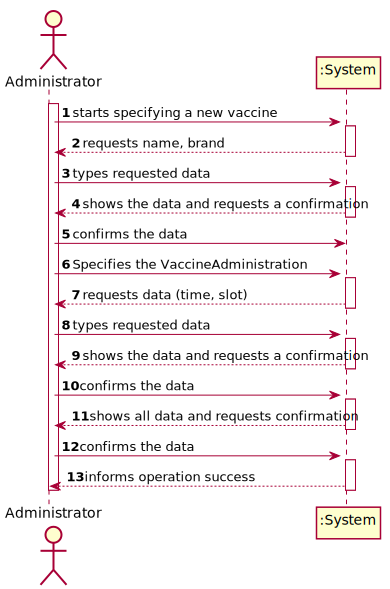
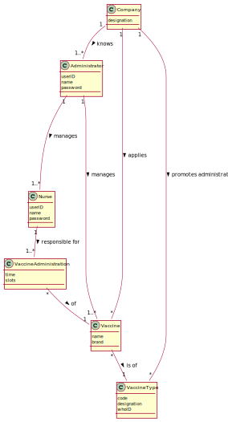
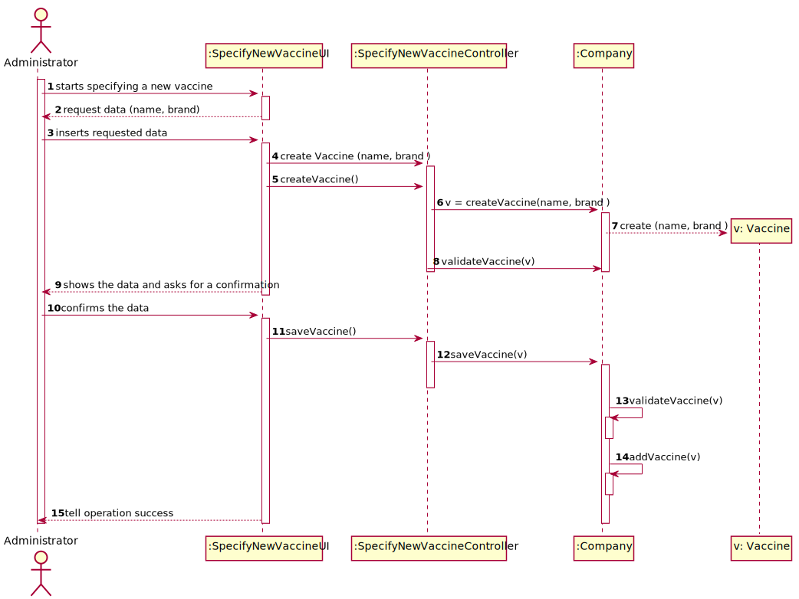
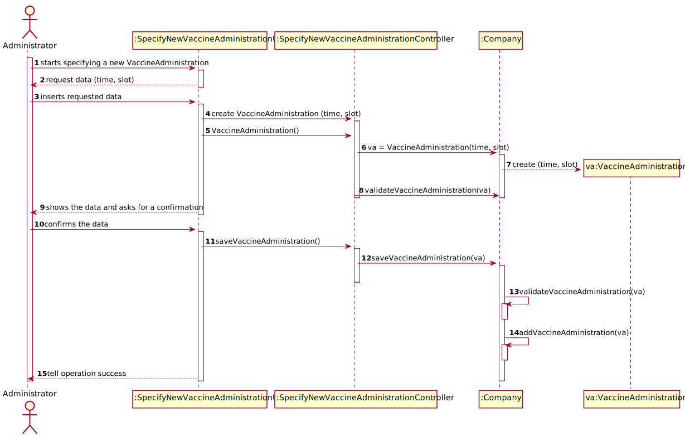
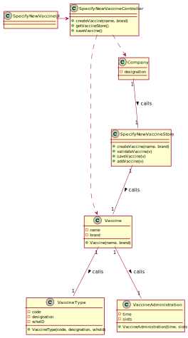

# US13 - To Specify a new Parameter Category

## 1. Requirements Engineering
In this section, it is suggested to capture the requirement description and specifications as provided by the client as well as any further clarification on it. It is also suggested to capture the requirements acceptance criteria and existing dependencies to other requirements. At last, identify the involved input and output data and depicted an Actor-System interaction in order to fulfill the requirement 
### 1.1. User Story Description
As an administrator, I intend to specify a new vaccine and its administration
process.
 
### 1.2. Customer Specifications and Clarifications

From the Specifications Document:

- “[…] the community mass vaccination centers are facilities specifically created to administer vaccines of a single type […]”
- “[…] healthcare center […] can administer any type of vaccines (e.g.: Covid-19, Dengue, Tetanus, smallpox).”
- “[…] several vaccines might exist, each one demanding a distinct administration process. (e.g.: Covid-19:Pfizer vaccine,Moderna vaccine,Astra Zeneca vaccine) […]”
- "The vaccine administration process comprises one or more age groups[…], the doses to be administered, the vaccine dosage, and the time interval […]"
- "[…] between doses, the dosage to be administered might vary as well as the time interval elapsing between two consecutive doses […]"
- “[…] The nurse checks the user info and health conditions in the system and in accordance with.”
- “[…] After giving the vaccine to the user, each nurse registers the event in the system more precisely, registers the vaccine type.”the scheduled vaccine type."

From the client clarifications:
- Question: When specifying a Vaccine and its Administration Process, are there any rules for the following attributes?
  (Name, Id, Brand, Number of doses,Dosage)
  - Answer:During Sprint B I will not introduce attribute rules/formats other than the ones that I already introduced (in this forum or in the project description). Please study the concepts and define appropriate formats for the attributes.
- Question: Is the recovery period the same through all types of vaccines, and vaccines, or does each vaccine have a certain recovery period? If each vaccine has a recovery period, is it different per age group and/or per dose?
  - Answer: ()
- Question:We would like to know if when specifying a new Vaccine and its Administration Process, should a list of the existing types of vaccines be displayed in order for him to choose one, or should he just input it?
           Also, in the Vaccine Type what information should each type contain?
  - Answer:1- If the information is available in the system, it is a good practice to present the information to the user and ask the user to select;
           2- I already answered this question.
- Question: I want to know if for each type of vaccine will you provide more information about administration process like number of doses, dosage, doses time interval or can we keep the e.g. of project description for all types of vaccines?
    - Answer: ()
- Question:Each age group will have his own time interval regarding two doses as well as the dosage to be administered in each dose?
    - Answer: ()
- Question:As to the interval between doses, what time format are we to use? (e.g. days, weeks, months)
    - Answer: Number of days.
- Question:1 - Is there any data that characterizes the vaccine administration process as well as business rules or acceptance criteria related to that data?
           2 - Can the vaccine administration process only be registered simultaneously with the creation of the vaccine or can it be added later?
    - Answer:()
- Question:Regarding the US13 (Specify a new vaccine and its administration process) is there more data that should be inserted besides the number of doses of the vaccine and the necessary time between doses?
    - Answer:()
- Question: 1.Does the Vaccine Administration Process refer to the administration of the vaccine for
             a single user or multiple users? And if it refers to a vaccination event for multiple users, is it for
             users of the same age group or not, like it is in real vaccination centers?
           2.Which attributes does the Vaccine have (besides the ones refering to the Vaccine Type)?
    - Answer: 1. In the project description we get: “...for each type of vaccine, several vaccines might exist, each one demanding a distinct administration process”.
              2. Each vaccine has the following attributes: Id, Name, Brand, Vaccine Type, Age Group, Dose Number, Vaccine Dosage and Time Since Last Dose.

### 1.3. Acceptance Criteria

- The vaccine administration process comprises:
   - one or more age groups (e.g.: 5 to 12 years old, 13 to 18 years old, greater than 18 years old),-
   - per age group, the doses to be administered (e.g.: 1, 2, 3)
   - the vaccine dosage (e.g.: 30 ml),
   - the time interval regarding the previously administered dose

### 1.4. Found out Dependencies

- Dependent on US13 "As an administrator, I intend to specify a new vaccine type.

### 1.5 Input and Output Data

*Identity here the data to be inputted by the system actor as well as the output data that the system have/needs to present in order to properly support the actor actions. Regarding the inputted data, it is suggested to distinguish between typed data and selected data (e.g. from a list)*
- Typed data: name, brand, time, slot
- Selected data: (name, brand, time, slot)
- Output data: (In)Sucess of the operation performed

### 1.6. System Sequence Diagram (SSD)

### 1.7 Other Relevant Remarks

**Omitted / Not Provided.**

## 2. OO Analysis

### 2.1. Relevant Domain Model Excerpt

### 2.2. Other Remarks

**Omitted / Not Provided.**

## 3. Design - User Story Realization

### 3.1. Rationale

| Interaction ID                                                | Question: Which class is responsible for...                            | Answer                  | Justification (with patterns) |
|:--------------------------------------------------------------|:-----------------------------------------------------------------------|:------------------------|:------------------------------|
| Step 1 - start specifying a new vaccine   		              | 	Instantiating a new vaccine 						                                | Company                 |                               |
| Step 2 - request data (name and brand)                          | 	Requesting data to the user						                                     | SpecifyNewVaccineUI |                               |
| Step 3 - types requested data		                               | Saving the input data					                                             | Vaccine             |                               |
| Step 4 - shows the data and requests a confirmation  		       | 	Validating the data locally	(eg: mandatory vs non-mandatory data)				 | Vaccine             |                               |
| Step 5 - specifying the  vaccine administration                   | Requesting data to the                                                               | SpecifyNewVaccineUI |
| Step 6 - types requested data		                               | Saving the input data					                                             | Vaccine Administration            |                               |
| Step 7 - shows the data and requests a confirmation  		       | 	Validating the data locally	(eg: mandatory vs non-mandatory data)				 | Vaccine Administration            |
|                                                                  | Validating the data globally (eg: duplicated data)						              | Company                 |                               |
| Step 9 - confirms data                                        | 	Saving the created vaccine						                                      | Company                 |                               |
| Step 10 - informs operation success                            | 	Informing the operation success						                                 | SpecifyNewVaccineTypeUI |                               |              

According to the taken rationale, the conceptual classes promoted to software classes are:

* CompanyDGS
* Vaccine
* VaccineType
* MenuVaccine

Other software classes (i.e. Pure Fabrication) identified:
* SpecifyNewVaccineUI
* NewVaccineUI
* SpecifyNewVaccineController

## 3.2. Sequence Diagram (SD)

## 3.3. Class Diagram (CD)

# 4. Tests

In this section, it is suggested to systematize how the tests were designed to allow a correct measurement of requirements fulfilling.

**Test 1:** Check that it is not possible to create an instance of the Example class with null values.

	@Test(expected = IllegalArgumentException.class)
		public void ensureNullIsNotAllowed() {
		Exemplo instance = new Exemplo(null, null);
	}

# 5. Construction (Implementation)

##ClasseVaccine

    public class Vaccine extends VaccineType{
    /**
    * The Vaccine name.
     */
    private String name;

    /**
     * The Vaccine Type brand.
     */
    private String brand;

    private double numberDoses;
    private String dosages;

        public Vaccine (String code, String designation, String WhoID , String name, String brand, Double numberDoses, String dosages) {
            super(code, designation, WhoID);
            setName(name);
            this.name = name;
            this.brand = brand;
            this.numberDoses = numberDoses;
            this.dosages = dosages;
        }
    
        /**
         * Returns the textual description of the vaccine.
         * @return attributes of vaccine
         */
        public String toSVaccine(){
            return String.format("The name of the vaccine is " +name+ "and your brand is "+brand +". "+super.toString()+ "Number of doses are" + numberDoses +" and dosage is"+ dosages);
    
        }
    }

##SpecifyNewVaccineController

    public class SpecifyNewVaccineController {

        private static CompanyDGS company;
        private Vaccine v;
    
        /**
         * Instantiates a Specify new vaccine controller.
         */
        public SpecifyNewVaccineController() {
            if (company == null){
                company = new CompanyDGS();
            }
        }
    
        /**
         * Instantiates a Specify new vaccine controller.
         *
         * @param company the companyDGS
         */
        public SpecifyNewVaccineController(CompanyDGS company) {
            this.company = company;
            this.v = null;
        }
    
         
        /**
         * create vaccine
         * @param code the code
         * @param designation the designation
         * @param WhoID the whoID
         * @param name the name
         * @param brand the brand
         * @return true if vaccine is validate and create. False otherwise
         */
    
        public boolean createVaccine(String code, String designation, String WhoID , String name, String brand) {
            this.v = this.company.createVaccine(code, designation, WhoID , name,brand);
            return this.company.validateVaccine(v);
        }
    
        /**
         * save vaccine
         * @return true if vaccine is saved. False otherwise
         */
        public boolean saveVaccine() {
            return this.company.saveVaccine(v);
        }
    
        /**
         * List vaccine.
         */
        public void listVaccine(){
            company.listVaccine();
        }

    }

##CreateNewEmployeeController

    public class CompanyDGS {

        private final List<Vaccine> vaccineList;
    
        /**
         * Instantiates a new Company dgs.
         */
        public CompanyDGS(){
            
            vaccineList = new ArrayList<>();
    
        }
    
        /**
         * Create vaccine
         * @param code the code
         * @param designation the designation
         * @param whoID the whoID
         * @param name the name
         * @param brand the brand
         * @return the vaccine
         */
        public Vaccine createVaccine(String code, String designation, String whoID, String name, String brand) {
            return new Vaccine (code, designation, whoID, name, brand);
    
        }
    
        /**
         * Validate vaccine
         * @param v the vaccine
         * @return the boolean
         */
    
        public boolean validateVaccine(Vaccine v) {
            if (v == null)
                return false;
            return ! this.vaccineList.contains(v);
        }
    
    
        /**
         * save vaccine
         * @param v vaccicne
         * @return false if vaccine validation is not invalid. True otherwise
         */
        public boolean saveVaccine(Vaccine v) {
            if (!validateVaccineType(v))
                return false;
            return this.vaccineList.add(v);
        }
    
        /**
         * Show the contents of the vaccine arraylist
         */
        public void listVaccine() {
            for (Vaccine v : vaccineList) {
                if (v != null) {
                    System.out.println(v.toSVaccine());
                }
            }
        }
    }

# 6. Integration and Demo

In this section, it is suggested to describe the efforts made to integrate this functionality with the other features of the system.

# 7. Observations

In this section, it is suggested to present a critical perspective on the developed work, pointing, for example, to other alternatives and or future related work.
