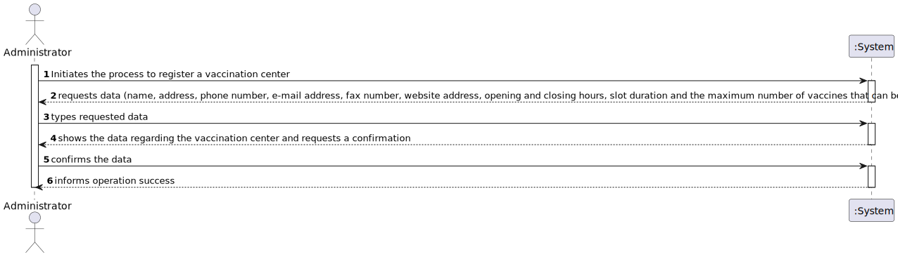
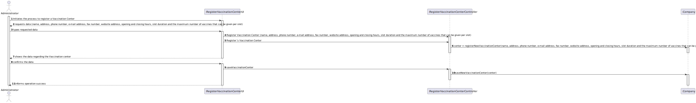

# US10 - Register a Vaccination Center

## 1. Requirements Engineering

### 1.1. User Story Description

As an administrator, I want to register a Vaccination Center.

### 1.2. Customer Specifications and Clarifications 

 **Omitted / Not Provided.**

  
### 1.3. Acceptance Criteria

Each user must have a single role defined in the system. The "auth" component available in the repository must be reused (without modifications).

### 1.4. Found out Dependencies

*Dependent on US9 "As an administrator, I want to register a Vaccination Center."*

### 1.5 Input and Output Data

**Input Data**
+ Typed Data: listType
+ Selected Data: Vaccination Center

**Output Data**

**None**
### 1.6. System Sequence Diagram (SSD)

**Omitted / Not Provided.**

### 1.7 Other Relevant Remarks

**Omitted / Not Provided.**

## 2. OO Analysis

### 2.1. Relevant Domain Model Excerpt 

DM.svg)

### 2.2. Other Remarks

**Omitted / Not Provided.**

## 3. Design - User Story Realization

### 3.1. Rationale

**Omitted / Not Provided.**

## 3.2. Sequence Diagram (SD)
  

  
## 3.3. Class Diagram (CD)

# 4. Tests 

**Omitted / Not Provided.**

# 5. Construction (Implementation)

**Omitted / Not Provided.**

# 6. Integration and Demo 

**Omitted / Not Provided.**

# 7. Observations

**Omitted / Not Provided.**

