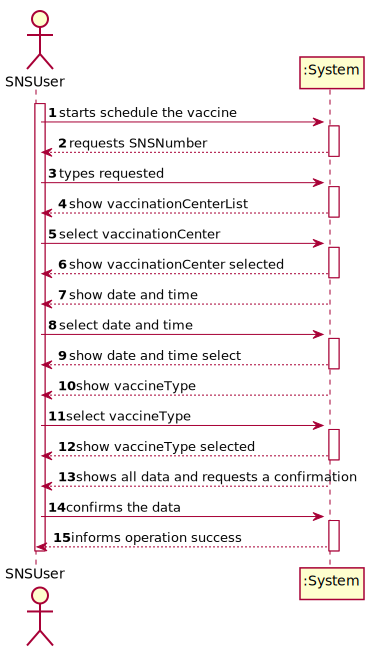
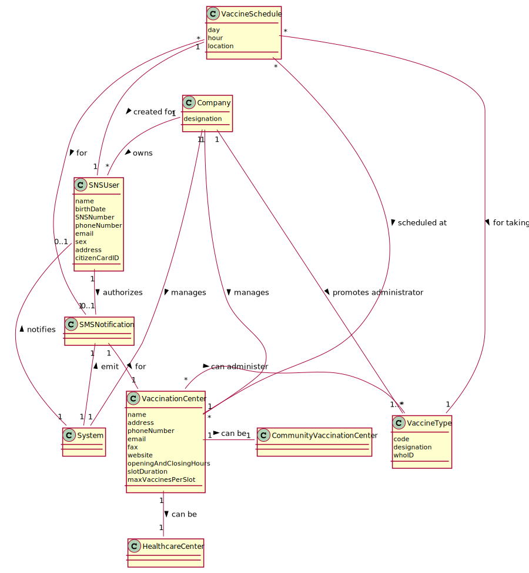
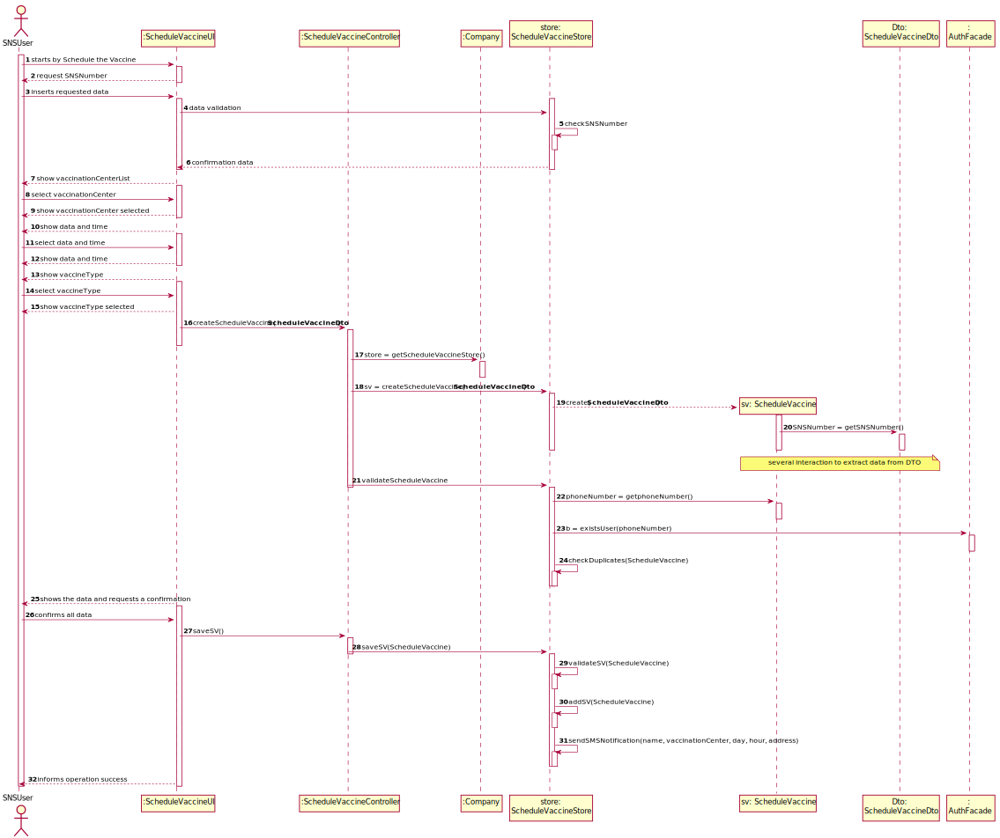
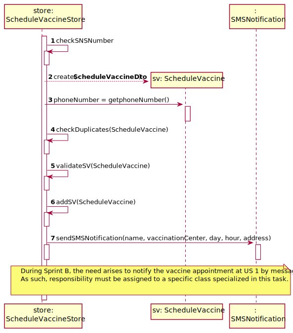
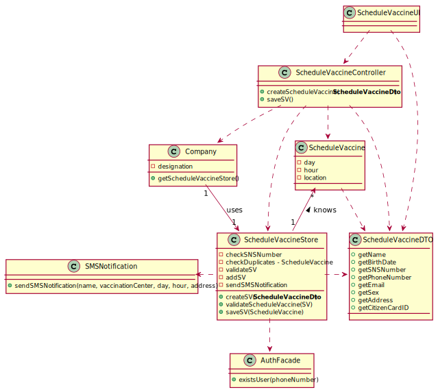

## 1. Engineering Requirements
In this section, it is suggested to capture the requirement description and specifications as provided by the client as well as any further clarification on it. It is also suggested to capture the requirements acceptance criteria and existing dependencies to other requirements. At last, identify the involved input and output data and depicted an Actor-System interaction in order to fulfill the requirement
### 1.1. User Story Description
As a SNS user, I intend to use the application to schedule a vaccine.
- Acceptance criteria: A SNS user cannot schedule the same vaccine more than
once.

### 1.2. Specifications and Clarifications

#### 1.2.1. From the Specifications Document:

- "[...] The user should introduce his/her SNS user number, select the vaccination center, the date, and the time (s) [...] 
  the type of vaccine to be administered [...]."
- "[...] the application should check the vaccination center capacity for that day/time and, if possible, confirm that 
  the vaccination is scheduled and inform the user [...]"
- "The SNS user may also authorize the DGS to send a SMS message with information about the scheduled appointment."
- "if the user authorizes the sending of the SMS, the application should send an SMS message when the vaccination event
   is scheduled and registered in the system. "
- "Some users (e.g.: older ones) may want to go to a healthcare center to schedule the vaccine appointment with the 
   help of a nurse"

#### 1.2.2. From the client clarifications:

- Clarification:

The acceptance criteria for US1 and US2 are: a. A SNS user cannot schedule the same vaccine more than once. b. The 
algorithm should check if the SNS User is within the age and time since the last vaccine".

This means:

a. At a given moment, the SNS user cannot have more than one vaccine (of a given type) scheduled;

b. The algorithm has to check which vaccine the SNS user took before and check if the conditions (age and time since the
last vaccine) are met. If the conditions are met the vaccination event should be scheduled and registered in the system.
When scheduling the first dose there is no need to check these conditions.

- Question: But for that we needed to have already an user storie mentioning the vaccine application by a nurse into a
            client. So how should we verify the last time he had the vaccine if we don't have that implemented ?
      - Answer:()
- Question: The acceptance criteria for US1 and US2 are: a. A SNS user cannot schedule the same vaccine more than once. 
            b. The algorithm should check if the SNS User is within the age and time since the last vaccine
    - Answer:We can always prepare a system for these two acceptance criteria. Even so, as we are in the final stage of 
             Sprint C, we will drop the acceptance criteria b ( The algorithm should check if the SNS User is within the
             age and time since the last vaccine). This acceptance criteria will be included in Sprint D.
- Question: What defines that a user doesn't have an appointment? For example: If a user goes to a vaccination center 
            at 25/05/2022, 11:00 and only has an appointment at 18:00 for that day, does this count as not ready to take
            the vaccine? What is the criteria for not having an appointment?
    - Answer:()
- Question: A SNS user cannot schedule the same vaccine more than once". When a User is Scheduling a vaccination 
            appointment, should he choose a vaccine or a typeOfVaccine? And how can the user comply with this Acceptance
            Criteria, since a vaccine has several doses, so he will have to choose that type of vaccine again in the 
            future in order to complete the vaccination process.
    - Answer:()
- Question: "The project description says "To take a vaccine, the SNS user should use the application to schedule his/
             her vaccination. The user should introduce his/her SNS user number, select the vaccination center, the date,
             and the time(s)he wants to be vaccinated as well as the type of vaccine to be administered [...]". Does the
             user have to enter the date and time they want or does the system have to show the available dates and 
             times for the user to select?"
    - Answer:In this sprint the actor should introduce (using the keyboard) the date and time (s)he wants to be 
             vaccinated.
- Question: When the chosen vaccination center is a Community Mass Vaccination Center(CMVC), it will provide only one 
            vaccine type to be scheduled. However, vaccine type is not an atributte of CMVC. Are we allowed to create an
            attribute of vaccine type in CMVC object?
    - Answer: Please study ESOFT and discuss this issue with ESOFT teachers.
- Question: 1- Are this acceptance criteria exclusive of each US or are implemented?
            2- To make the development of each US more clear, could you clarify the differences between US1 and US2?
    - Answer:  1- The acceptance criteria for US1 and US2 should be merged. The acceptance criteria por US1 and US2 is: 
               2- A SNS user cannot schedule the same vaccine more than once. The algorithm should check if the SNS User
               is within the age and time since the last vaccine. In US1 the actor is the SNS user, in US2 the actor is
               the receptionist. In US1 the SNS user is already logged in the system and information that is required 
               and that exists in the system should be automatically obtained. In US2 the receptionist should ask the 
               SNS user for the information needed to schedule a vaccination. Information describing the SNS user should
               be automatically obtained by introducing the SNS user number.
- Question: The SNS user should select the vaccination cente.  how should the SNS user know which vaccination centers 
            are available on the app? From my point of view, the SNS user should be able to choose from a list of 
            available vaccination centers, which were previously inserted on the system. Could you validate if this is 
            the approach you are looking for?
      - Answer:()
- Question: We would like to know if when scheduling a vaccine, should a list of  existing vaccine types and vaccination
            centers be displayed in order for him to choose one option , or should he just enter them?
    - Answer:Please check carefully the project description available in moodle.
- Question: We are unsure if it's in this user stories that's asked to implement the "send a SMS message with 
            information about the scheduled appointment" found on the Project Description available in moodle. Could 
            you clarify?
    - Answer: The user should receive a] SMS Message to warn of a scheduling [and the message] should include: Date, 
              Time and vaccination center
- Question: As a SNS user, I intend to use the application to schedule a vaccine.", should the application already send 
            the SMS with the confirmation of the schedule or it will be other user story in the future
    - Answer:()

### 1.3. Acceptance Criteria

- The schedule a vaccine:
    - A SNS user cannot schedule the same vaccine more than once.

### 1.4. Found out Dependencies

- US13: "As an administrator, I intend to specify a new vaccine and its administration
  process"
- US9: "As an administrator, I want to register a vaccination center to respond to a certain
  pandemic"

### 1.5 Input and Output Data

*Identity here the data to be inputted by the system actor as well as the output data that the system have/needs to
present in order to properly support the actor actions. Regarding the inputted data, it is suggested to distinguish 
between typed data and selected data (e.g. from a list)*

#### 1.5.1. Input Data

snsNumber
vaccinationCenter
data
time
vaccineType

#### 1.5.2. Output Data
Success of the operation

### 1.6. System Sequence Diagram (SSD)

### 1.7 Other Relevant Remarks

There are some similarities to US 2 regarding the need (i) schedule the vaccine (ii) to send an sms to the user.

## 2. OO Analysis

### 2.1. Relevant Domain Model Excerpt

### 2.2. Other Remarks

**Omitted / Not Provided.**

## 3. Design - User Story Realization

### 3.1. Rationale

| Interaction ID        | Question: Which class is responsible for...             | Answer                           | Justification (with patterns)                                                                                                     |
|:----------------------|:--------------------------------------------------------|:---------------------------------|:----------------------------------------------------------------------------------------------------------------------------------|
|                       |interacting with the actor?                              |ScheduleVaccineUI                 |Pure Fabrication: there is no reason to assign this responsibility to any existing class in the Domain Model.
|                       |coordinating the US?                                     |ScheduleVaccineController         |Controller
|                       |transfer the data typed in the UI to the domain?         |ScheduleVaccineDto                |DTO: When there is so much data to transfer, it is better to opt by using a DTO in order to reduce coupling between UI and domain.
| Step 1                |Instantiating a new schedule vaccine ?					  |Company                           |
| Step 2                |Request the sns number?					              |ScheduleVaccineUI                 |Is responsible for user interaction
| Step 3                |Validate types Requested?					              |ScheduleVaccineStore              |                               |
| Step 4 	            |shows the show vaccinationCenterList?			          |ScheduleVaccineUI                 |Is responsible for user interaction                               |
| Step 5                |select vaccinationCenter?                                |SNSUser                           | SpecifyNewVaccineUI     |                               |
| Step 6 	            |show vaccinationCenter selected?					      |ScheduleVaccineUI                 |Is responsible for user interaction                              |
| Step 7  		        |show date and time?		                              |ScheduleVaccineUI                 |Is responsible for user interaction                              |
| step 8                |select date and time ?                                   |SNSUser                           |                               |
| step 9                |show date and time select ?                              |ScheduleVaccineUI                 |Is responsible for user interaction                              |
| step 10               |show vaccineType  ?                                      |ScheduleVaccineUI                 |Is responsible for user interaction                               |
| step 11               |select vaccineType                                       |SNSUser                           |                               |
| step 12               |show vaccineType selected ?                              |ScheduleVaccineUI                 |Is responsible for user interaction                           |                               |
| step 13               |create Schedule Vaccine?                                 |ScheduleVaccineStore              |
| step 14               |validate Schedule Vaccine?                               |ScheduleVaccineStore              |An object knows its data
| step 15               |validate the exclusivity of the phone number?            |AuthFacade                        |User management is responsibility of the respective external component whose point of interaction is through the class "AuthFacade"
| step 16               |checkDuplicates(ScheduleVaccine)                         |ScheduleVaccineStore              |adopts/records all the objects
| step 17               |save Schedule Vaccine?                                   |ScheduleVaccineStore              |Adopts/records all the objects
| step 18               |shows all data and requests a confirmation?              |ScheduleVaccineUI                 |knows its own data                          |                               |
| Step 19               |sending email?						                      |**SMSNotification**               |Pure Fabrication:** has all the required information and means to send the sms                               |
| Step 20               |Informing the operation success?						  | ScheduleVaccineUI                |Is responsible for user interactions                      |              

According to the taken rationale, the conceptual classes promoted to software classes are:
* Company
* ScheduleVaccine

Other software classes (i.e. Pure Fabrication) identified:

* ScheduleVaccineUI
* ScheduleVaccineController
* ScheduleVaccineStore
* ScheduleVaccineDto
* **SMSNotification**

Other software classes of external systems/components:

* AuthFacade

## 3.2. Sequence Diagram (SD)

## 3.3. Class Diagram (CD)

# 4. Tests

In this section, it is suggested to systematize how the tests were designed to allow a correct measurement of 
requirements fulfilling.

**Test 1:** Check that it is not possible to create an instance of the Example class with null values.

	@Test(expected = IllegalArgumentException.class)
		public void ensureNullIsNotAllowed() {
		Exemplo instance = new Exemplo(null, null);
	}

# 5. Construction (Implementation)

# 6. Integration and Demo

In this section, it is suggested to describe the efforts made to integrate this functionality with the other features 
of the system.

# 7. Observations

In this section, it is suggested to present a critical perspective on the developed work, pointing, for example, to 
other alternatives and or future related work.
