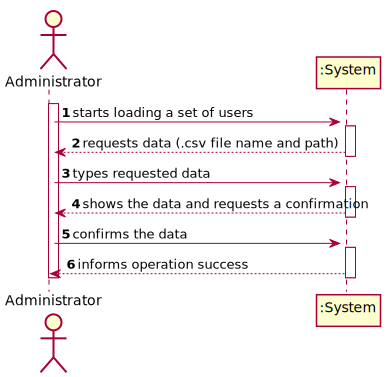
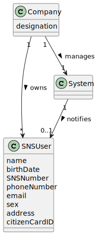
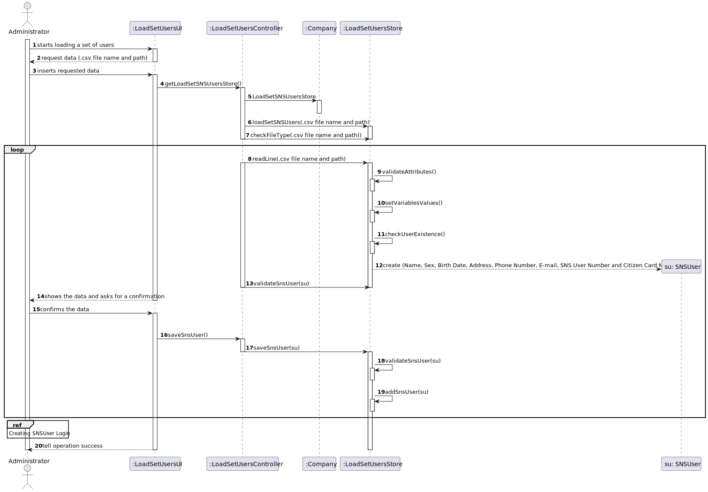
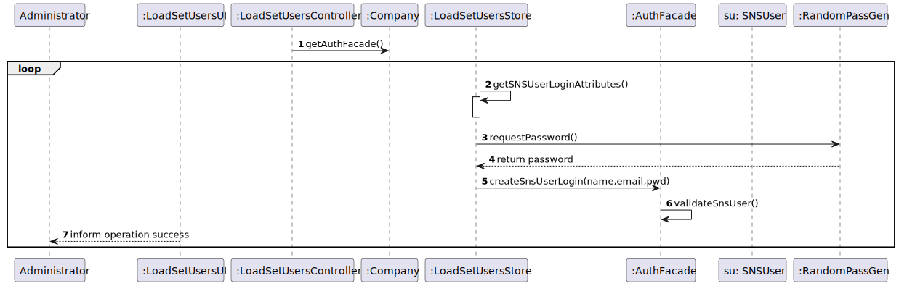
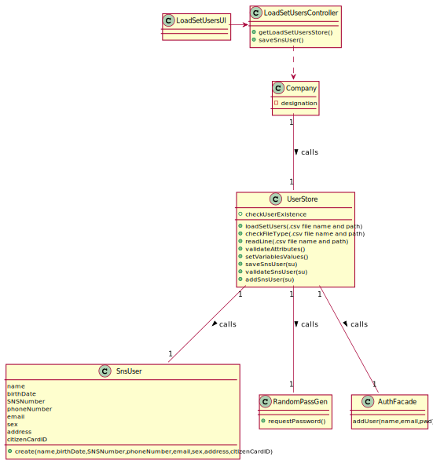

# US 14 - Load Set of Users from a file

## 1. Requirements Engineering

*In this section, it is suggested to capture the requirement description and specifications as provided by the client as well as any further clarification on it. It is also suggested to capture the requirements acceptance criteria and existing dependencies to other requirements. At last, identify the involved input and output data and depicted an Actor-System interaction in order to fulfill the requirement.*

### 1.1. User Story Description

*As an administrator, I want to load a set of users from a CSV file.*

### 1.2. Customer Specifications and Clarifications
From the Specifications Document:

From the client clarifications:
- Question: "Regarding US014, I would like to clarify if the CSV file only contains information about SNS users of if the CSV file may also contain some information about employees from that vaccination center."
- Answer: The CSV file only contains information about SNS users.
- Question: "What would be the sequence of parameters to be read on the CSV? For example: "Name | User Number".
- Answer: Name, Sex, Birth Date, Address, Phone Number, E-mail, SNS User Number and Citizen Card Number.
- Question: "When the admin wants to upload a CSV file to be read, should the file be stored at a specific location on the computer (e.g. the desktop) or should the admin be able to choose the file he wants to upload in a file explorer?"
- Answer: The Administrator should write the file path. In Sprint C we do not ask students to develop a graphical user interface.
- Question: "In witch format will be given the date of birth (YYYY/MM/DD or DD/MM/YYYY)"
- Answer: In a previous clarification I said: "The dates registered in the system should follow the Portuguese format (dd/mm/yyyy)".
- Question: "Is it possible that the file can contain lines with incomplete information in some fields (e.g. N/A). If so, should we read those lines as well and leave those fields empty or shall we discard that complete line? "
- Answer: CSV files that have errors should not be loaded. Opcional attributes may have a NA value.
- Question: "Are there any SNS User attributes that can be omitted?"
- Answer: I already answered one question related to US3 that answers your question. The Sex attribute is optional (it can also take the NA value). All other fields are required.
- Question: "how should the admin receive the login data/passwords for all registered users?"
- Answer: During this sprint, login and password data should be presented in the console application. In US14 the application is used to register a batch of users. For each user, all the data required to register a user should be presented in the console.
- Question: This question also regards the attribute sex, is the format "F"/"M"/ "N/A", or "female"/"male"/"N/A" , or a different, or can it be any? 
- Answer: From a previous answer we get "Opcional attributes may have a NA value".
- Question: "is there any specific format that should be validated for the address, or we can assume it is just of string type?"
- Answer: The address contained in the CSV file is a string and should not contain commas or semicolons.
- Question: "Should we check if the users from the CSV file are already registered in the system? If so, which data should we use, the one already in the system or the one on the file?"
- Answer: This feature of the system will be used to register a batch users. If the user is already registered in the system, then the information available in the CSV file should not be used to register that user.
- Question: "What should the system do if the file to be loaded has information that is repeated? For example, if there are 5 lines that have the same information or that have the same attribute, like the phone number, should the whole file be discarded?"
- Answer: If the file does not have other errors, all records should be used to register users. The business rules will be used to decide if all file records will be used to register a user. For instance, if all users in the CSV file are already registered in system, the file should be processed normally but no user will be added to the system (because the users are already in the system).
- Question: "Should our application detect if the CSV file to be loaded contains the header, or should we ask the user if is submitting a file with a header or not?"
- Answer: The application should automatically detect the CSV file type.

### 1.3. Acceptance Criteria

- AC1: The application must support importing two types of CSV
  files: a) one type must have a header, column separation is done using “;”
  character; b) the other type does not have a header, column separation is done
  using “,” character.
- AC2: The application must support reading the file from any place it is stored in the computer.

### 1.4. Found out Dependencies

- No dependencies were found.

### 1.5 Input and Output Data

*Identity here the data to be inputted by the system actor as well as the output data that the system have/needs to present in order to properly support the actor actions. Regarding the inputted data, it is suggested to distinguish between typed data and selected data (e.g. from a list)*
- Typed data: .csv file name and path
- Selected data: information about the users inside the file
- Output data: (In)Sucess of the operation performed

### 1.6. System Sequence Diagram (SSD)

### 1.7 Other Relevant Remarks

*Use this section to capture other relevant information that is related with this US such as (i) special requirements ; (ii) data and/or technology variations; (iii) how often this US is held.*

## 2. OO Analysis

### 2.1. Relevant Domain Model Excerpt
*In this section, it is suggested to present an excerpt of the domain model that is seen as relevant to fulfill this requirement.*

### 2.2. Other Remarks

*Use this section to capture some aditional notes/remarks that must be taken into consideration into the design activity. In some case, it might be usefull to add other analysis artifacts (e.g. activity or state diagrams).*

## 3. Design - User Story Realization

### 3.1. Rationale

**The rationale grounds on the SSD interactions and the identified input/output data.**

| Interaction ID                                          | Question: Which class is responsible for...                            | Answer            | Justification (with patterns)                   |
|:--------------------------------------------------------|:-----------------------------------------------------------------------|:------------------|:------------------------------------------------|
| Step 1 - starts loading a set of users 		               | 	Communicating with the user						                                     | LoadSetUsersUI    | IE: responsible for communicating with the user |
| Step 2 - request data (file name and path)	             | 	Requesting data to the user						                                     | LoadSetUsersUI    | IE                                              |
| Step 3 - types requested data		                         | Creating the SnsUser object					                                       | SnsUser           | Creator: Responsible for creating the user      |
| Step 4 - shows the data and requests a confirmation  		 | 	Validating the data locally	(eg: mandatory vs non-mandatory data)				 | SnsUser           | IE: knows its own data                          |
| 	                                                       | 	Validating the data globally (eg: duplicated data)						              | LoadSetUsersStore | IE: knows all the SnsUser objects               |
| Step 5 - confirms data                                  | 	Saving the created User						                                         | LoadSetUsersStore | IE: Records all the SnsUser objects             |
| Step 6 - informs operation success                      | 	Informing the operation success						                                 | LoadSetUsersUI    | IE: responsible for communicating with the user |              

### Systematization ##

According to the taken rationale, the conceptual classes promoted to software classes are:
* 

Other software classes (i.e. Pure Fabrication) identified:
* 

## 3.2. Sequence Diagram (SD)

*In this section, it is suggested to present an UML dynamic view stating the sequence of domain related software objects' interactions that allows to fulfill the requirement.*

## 3.3. Class Diagram (CD)

*In this section, it is suggested to present an UML static view representing the main domain related software classes that are involved in fulfilling the requirement as well as and their relations, attributes and methods.*

# 4. Tests
*In this section, it is suggested to systematize how the tests were designed to allow a correct measurement of requirements fulfilling.*

**_DO NOT COPY ALL DEVELOPED TESTS HERE_**

**Test 1:** Check that it is not possible to create an instance of the Example class with null values.

       @Test
    void testEqualsAttributes() {
        boolean expectedValue = true;
        User user = new User("Tiago", "MASCULINE", "10/12/2010", "Rua nova", 967654321, "tiago@gmail.com", 123456789, 987654321);
        User user1 = new User("Tiago","MASCULINE","10/12/2010","Rua nova",967654321,"tiago@gmail.com",123456789,987654321);
        boolean currentValue = user.equals(user1);
        assertEquals(expectedValue, currentValue);
    }
    @Test
    void testEquals() {
        boolean expectedValue = true;
        User user = new User("Tiago","MASCULINE","10/12/2010","Rua nova",967654321,"tiago@gmail.com",123456789,987654321);
        boolean currentValue = user.equals(user);
        assertEquals(expectedValue,currentValue);
    }
     @Test
    void setSexInvalid() {
        User user = new User("Tiago","MASCULINE","10/12/2010","Rua nova",967654321,"tiago@gmail.com",123456789,987654321);
        IllegalArgumentException exception = assertThrows(IllegalArgumentException.class, new Executable(){
            @Override
            public void execute() throws Throwable {
                // The method to test expected to generate an exception
                user.setSex("MASC");
            }
        });
        String exceptionMessage = exception.getMessage();
        String expectedMessage = "invalid sex.";

        assertEquals(expectedMessage, exceptionMessage);
    }

*It is also recommended to organize this content by subsections.*

# 5. Construction (Implementation)

*The code is implemented as per the design.*

# 6. Integration and Demo

*In this section, it is suggested to describe the efforts made to integrate this functionality with the other features of the system.*

# 7. Observations

*In this section, it is suggested to present a critical perspective on the developed work, pointing, for example, to other alternatives and or future related work.*