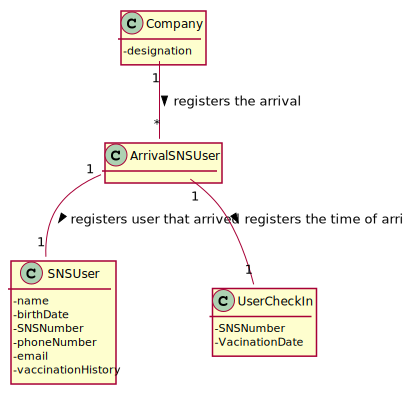

# US 4 - Register the arrival of a SNS user to take the vaccine.

## 1. Requirements Engineering

**

### 1.1. User Story Description

**As a receptionist at a vaccination center, I want to register the arrival of a SNS user
to take the vaccine.**

### 1.2. Customer Specifications and Clarifications 

**From the specifications document:**

>	When the SNS user arrives at the vaccination center, a receptionist registers the arrival of the user to take the respective vaccine.

>	The receptionist asks the SNS user for his/her SNS user number and confirms that he/she has the vaccine scheduled for the that day and time.

**From the client clarifications:**

> **Question:** Respectively to US04, after the receptionist registers the SNS User's arrival at the Vaccination Center, the system creates the list that will be available for the Nurse to view, correct?
>
> **Answer:** The nurse checks the list (of SNS users in the waiting room) in US05.

> **Question:** Regarding US04, I would like to know what's the capacity of the waiting room.

> **Answer:** The waiting room will not be registered or defined in the system. The waiting room of each vaccination center has the capacity to receive all users who take the vaccine on given slot.

> **Question:** When the SNS user number is introduce by the receptionist and the system has no appointment for that SNS user number, how should the system proceed?
>
> **Answer:** The application should present a message saying that the SNS user did not schedule a vaccination.

> **Question:** Regarding US04, a receptionist register the arrival of an SNS user immediately when he arrives at the vaccination center or only after the receptionist confirms that the respective user has a vaccine schedule for that day and time.
>
> **Answer:** The receptionist registers the arrival of an SNS user only after confirming that the user has a vaccine scheduled for that day and time.

### 1.3. Acceptance Criteria

* **AC1:** No duplicate entries should be possible for the same SNS user on the same day or vaccine period.
* **AC2:** For the SNS User arrival to be registered, first he/she needs to have a vaccination scheduled.

### 1.4. Found out Dependencies

**No Dependencies Found**

### 1.5 Input and Output Data
**Input Data:**

* Typed data:
    * SNSNumber
    * Arrival Time

**Output Data:**

* List of all SNS users that arrive at the vaccination center
* Success of the operation (if successful)
### 1.6. System Sequence Diagram (SSD)

*Insert here a SSD depicting the envisioned Actor-System interactions and throughout which data is inputted and outputted to fulfill the requirement. All interactions must be numbered.*

### 1.7 Other Relevant Remarks

**No other relavant remarks**

## 2. OO Analysis

### 2.1. Relevant Domain Model Excerpt 
*In this section, it is suggested to present an excerpt of the domain model that is seen as relevant to fulfill this requirement.* 

### 2.2. Other Remarks

**No other relevant remarks**

## 3. Design - User Story Realization 

### 3.1. Rationale

**The rationale grounds on the SSD interactions and the identified input/output data.**

| Interaction ID | Question: Which class is responsible for...            | Answer                    | Justification (with patterns)                                                                                  |
|:--------------|:-------------------------------------------------------|:--------------------------|:---------------------------------------------------------------------------------------------------------------|
| Step 1  		    | 	... interacting with the actor	                       | ArrivalRegisterUI         | Pure Fabrication : there is no reason to assign this responsibility to any existing class in the Domain Model. |
| 		            | 	... coordenating the US						                         | ArrivalRegisterController | Controller                                                                                                     |
| Step 2  		    | 							                                                |                           |                                                                                                                |
| Step 3  		    | 	... allowing the input of the SNSUser						           | ArrivalRegisterUI         | Pure Fabrication: there is no reason to assign this responsibility to any existing class in the Domain Model.  |
| Step 4  		    | 							                                                |                           |                                                                                                                |
| Step 5  		    | ... save the data 						                               | VaccineArrivalStore       | IE: object created has its own data                                                                            |
| Step 6  		    | 							                                                |                           |                                                                                                                |              
| Step 7  		    | 	... validating all data (local validation)?						     | VaccineSchedulleStore     | IE: owns its data.                                                                                             |
| 	             | 	... validating Receptionist (local validation)?						 | VaccineSchedulleStore     | IE: owns its data.                                                                                             |
|  		           | ... validating all data (global validation)? 							   | VaccineSchedulleStore     | IE: stores all schedulles                                                                                      |
| Step 10  		   | ... informs of the operation success?							           | ArrivalRegisterUI         | IE: is responsible for user interaction                                                                                                                |  

### Systematization ##

According to the taken rationale, the conceptual classes promoted to software classes are: 

 * SNSUser
 * VaccineCenter
 * Company

Other software classes (i.e. Pure Fabrication) identified: 
 * ArrivalRegisterUI 
 * ArrivalRegisterController

## 3.2. Sequence Diagram (SD)

*In this section, it is suggested to present an UML dynamic view stating the sequence of domain related software objects' interactions that allows to fulfill the requirement.* 

## 3.3. Class Diagram (CD)

*In this section, it is suggested to present an UML static view representing the main domain related software classes that are involved in fulfilling the requirement as well as and their relations, attributes and methods.*

# 4. Tests 

# 5. Construction (Implementation)

# 6. Integration and Demo 

*Since this User Story is independent, it was not needed to estabilish a connection to any User Story.*

# 7. Observations
* Method create has too many parameters. Maybe the use of DTOs, can solve the issue.

