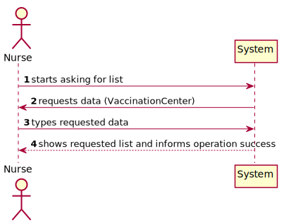
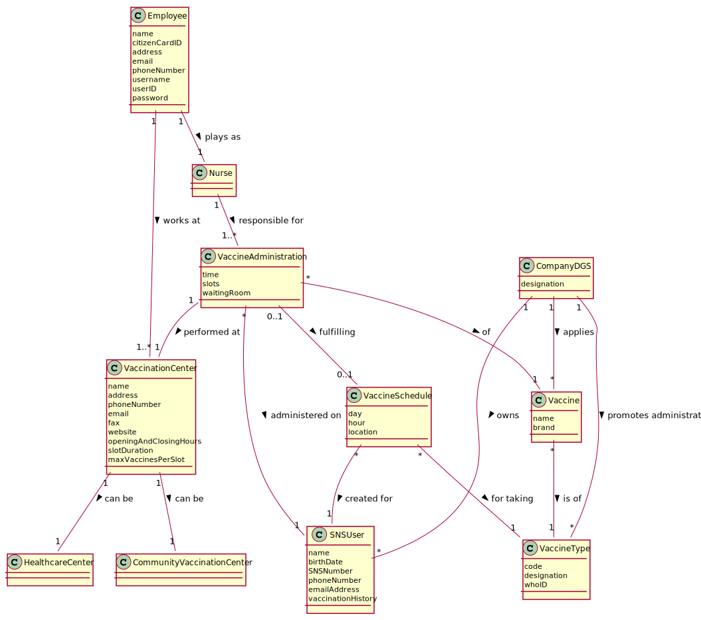
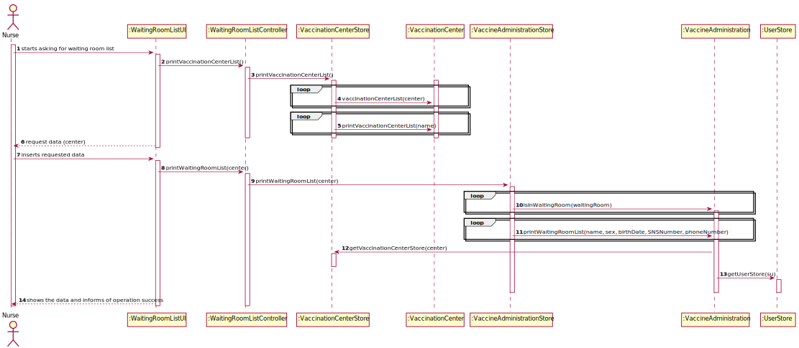
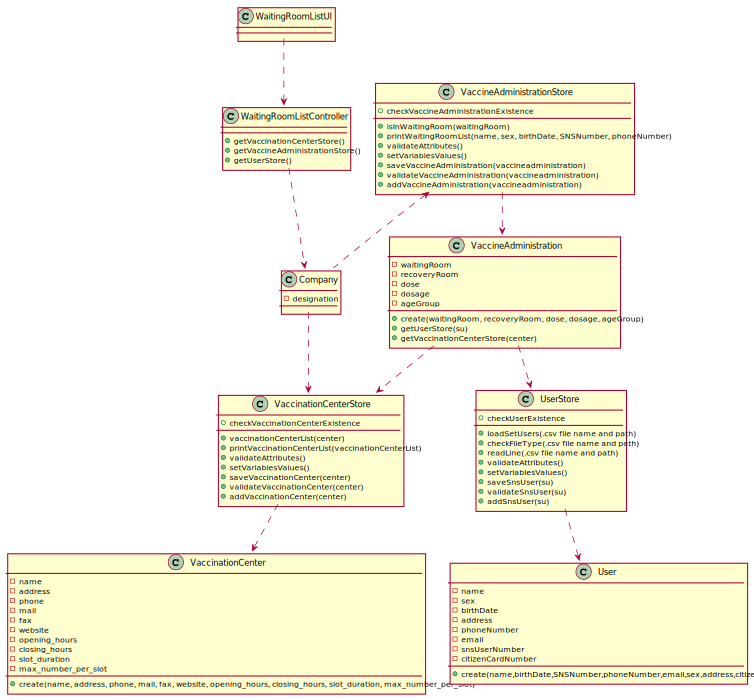

# US5 - Waiting Room of a Vaccination Center

## 1. Engineering Requirements

In this section, it is suggested to capture the requirement description and specifications as provided by the client as well as any further clarification on it. It is also suggested to capture the requirements acceptance criteria and existing dependencies to other requirements. At last, identify the involved input and output data and depicted an Actor-System interaction in order to fulfill the requirement

### 1.1. User Story Description

As a nurse, I intend to consult the users in the waiting room of a vacination center.

### 1.2. Specifications and Clarifications

#### 1.2.1. From the Specifications Document:

- "At any time, a nurse responsible for administering the vaccine will use the application to check the list of SNS users that are present in the vaccination center to take the vaccine and will call one SNS user to administer him/her the vaccine."

#### 1.2.2. From the client clarifications:

- Nurses and receptionists can work in any vaccination center.
- The goal is to check the list of users that are waiting and ready to take the vaccine.
- When the nurse starts to use the application, firstly, the nurse should select the vaccination center where she his working. The nurse wants to check the list of SNS users that are waiting in the vaccination center where she his working.
- The waiting room will not be registered or defined in the system. The waiting room of each vaccination center has the capacity to receive all users who take the vaccine on given slot.
- In the list, each user should be displayed with their name, sex, birthdate, SNS user number and phone number.

### 1.3. Acceptance Criteria

- SNS Users’ list should be presented by order of arrival.

### 1.4. Found out Dependencies

- US4: "As a receptionist at a vaccination center, I want to register the arrival of a SNS user
  to take the vaccine."

### 1.5 Input and Output Data

*Identify here the data to be inputted by the system actor as well as the output data that the system have/needs to present in order to properly support the actor actions. Regarding the inputted data, it is suggested to distinguish between typed data and selected data (e.g. from a list)*

#### 1.5.1. Input Data

* VaccinationCenter

#### 1.5.2. Output Data

* printWaitingRoomList()

### 1.6. System Sequence Diagram (SSD)

### 1.7 Other Relevant Remarks

**Omitted / Not Provided.**

## 2. OO Analysis

### 2.1. Relevant Domain Model Excerpt

### 2.2. Other Remarks

**Omitted / Not Provided.**

## 3. Design - User Story Realization

### 3.1. Rationale

| Interaction ID                                                                                                                           | Question: Which class is responsible for... | Answer                                                     | Justification (with patterns)                                          |
|:-----------------------------------------------------------------------------------------------------------------------------------------|:--------------------------------------------|:-----------------------------------------------------------|:-----------------------------------------------------------------------|
| Step 1 - starts asking for the list of users in a vaccination center's waiting room. 		              | 	Communicating with the user?						         | WaitingRoomListUI                           | IE: The UI is responsible for communicating with the user. |
| Step 2 - request data (which vaccination center the nurse wants to check the waiting room list of)	                                      | 	Requesting data to the user?						         | WaitingRoomListUI                                          | IE: The UI is responsible for requesting input data from the user.     |
| Step 3 - types requested data		                                                                                                          | Making the waiting room list?					          | VaccineAdministrationStore                                 | Creator: Responsible for creating the list.                            |
| Step 4 - shows the data and informs operation success 		                                                                                 | 	Showing the waiting room list?				         | WaitingRoomListUI                                          | IE: The UI is responsible for displaying the output data for the user. | 	                                                                                                   | 	Validating the data globally (eg: duplicated data)						              | LoadSetUsersStore | IE: knows all the SnsUser objects                                   |

According to the taken rationale, the conceptual classes promoted to software classes are:

* SNS User
* Vaccine Administration

Other software classes (i.e. Pure Fabrication) identified:

## 3.2. Sequence Diagram (SD)

## 3.3. Class Diagram (CD)

# 4. Tests

In this section, it is suggested to systematize how the tests were designed to allow a correct measurement of requirements fulfilling.

**Test 1:** Check that it is not possible to create an instance of the Example class with null values.

	@Test(expected = IllegalArgumentException.class)
		public void ensureNullIsNotAllowed() {
		Exemplo instance = new Exemplo(null, null);
	}

# 5. Construction (Implementation)

# 6. Integration and Demo

In this section, it is suggested to describe the efforts made to integrate this functionality with the other features of the system.

# 7. Observations

In this section, it is suggested to present a critical perspective on the developed work, pointing, for example, to other alternatives and or future related work.
