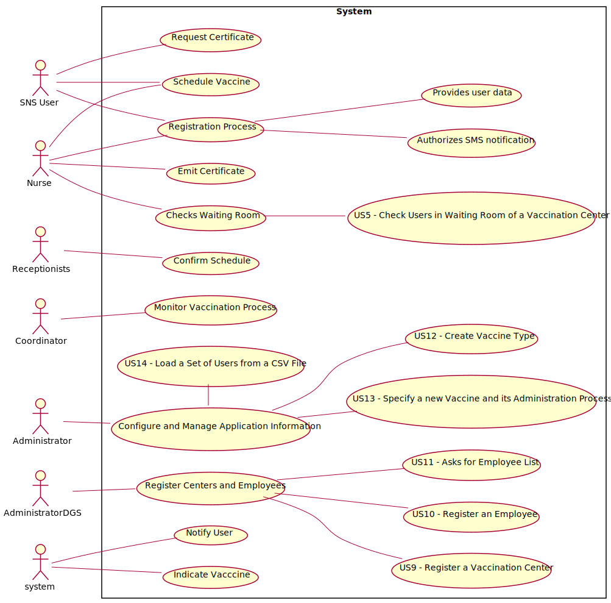

# Use Case Diagram (UCD)

**In the scope of this project, there is a direct relationship of _1 to 1_ between Use Cases (UC) and User Stories (US).**

However, be aware, this is a pedagogical simplification. On further projects and curricular units might also exist _1 to N **and/or** N to 1 relationships between US and UC.

**Insert below the Use Case Diagram in a SVG format**

**For each UC/US, it must be provided evidences of applying main activities of the software development process (requirements, analysis, design, tests and code). Gather those evidences on a separate file for each UC/US and set up a link as suggested below.**

# Use Cases / User Stories
| UC/US  | Description                                    |                   
|:-------|:-----------------------------------------------|
| US 007 | [Register Adverse Reactions](US7.md)           |
| US 009 | [Register a Vaccination Center](US9.md)        |
| US 010 | [Register an Employee](US10.md)                |
| US 011 | [Employee List](US11.md)                       |
| US 012 | [Create Vaccine Type](US12.md)                 |
| US 013 | [To Specify a new Parameter Category](US13.md) |
