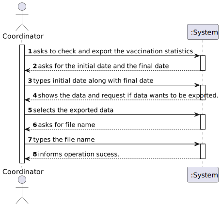
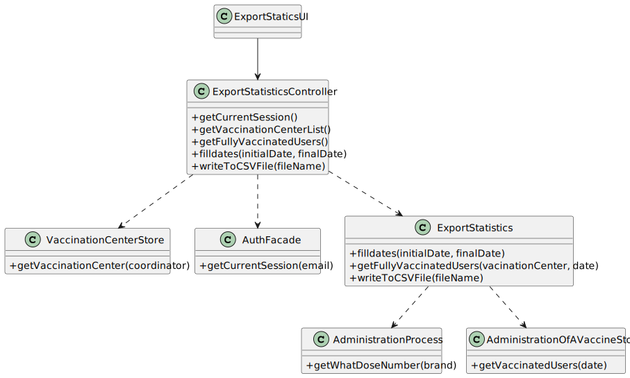

# US 15 - To check and export vaccination statistics

## 1. Requirements Engineering

### 1.1. User Story Description

As a center coordinator, I intended to check and export vaccination statistics. I want to export, to a csv file, the total number of fully vaccinated users per day.

### 1.2. Customer Specifications and Clarifications

**From the specifications Document:**

**From the client clarifications:**

> **Question:** Is there any kind of format our exported data should follow

> **Answer:** Data format: date; number of fully vaccinated user.

> **Question:** Is the exportation of the CSV file that contains the total number of fully vaccinated users per day, the only feature that needs to be implemented in code, for US15?

> **Answer:** Yes.

> **Question:** Are the vaccination statistics refering only to the fully vaccinated users or refering to something more?

> **Answer:** Only to fully vaccinated users.

> **Question:** In this US should the Center Coordinator check and export the Vaccination Statistics of the Center where he/she works at or should just check and export the Vaccination Statistics of all centers?

> **Answer:** The center coordinator can only export statistics from the vaccination center that he coordinates
 

### 1.3. Acceptance Criteria

* **AC1:** The Date should follow the following format (dd/mm/yyyy);
* **AC2:** The exported file needs to have this format: date; number of vaccinated users.

### 1.4. Found out Dependencies

There is a dependency to US8.

### 1.5 Input and Output Data

**Input Data:**

* Typed data:
    * initial date
    * final date
    * name of the file
    
**Output Data:**
* list of users that were vaccinated in that day
* file with the number of vaccinated users in that day
* Success of the operation

### 1.6. System Sequence Diagram (SSD)

### 1.7 Other Relevant Remarks

## 2. OO Analysis
### 2.1. Relevant Domain Model Excerpt

### 2.2. Other Remarks

## 3. Design - User Story Realization

#### 3.1. Rationale

**The rationale grounds on the SSD interactions and the identified input/output data.**

| Interaction ID | Question: Which class is responsible for...                             | Answer                        | Justification (with patterns)                                                        |
|:---------------|:------------------------------------------------------------------------|:------------------------------|:-------------------------------------------------------------------------------------|
| Step 1  		     | ... interacting with the actor?						                                   | ExportStatisticsUI            | Pure Fabrication:there is no reason to assign this responsability                    |
|                | ... coordinating the US?                                                | ExportStatisticsController    | Controller                                                                           |
| 		             | 							                                                                 |                               |                                                                                      |
| Step 2  		     | 	 ... login session? 					                                              | AuthFacade                    | IE                                                                                   |
|                | ...knowing what is vaccination center where the coordinator works?      | VaccinationCenterStore        | IE: knows all the existing vaccination centers and each one has it´s own coordinator |
|                | ...knowing what are the total doses of the vaccines?                    | AdmistrationProcess           | IE: an object that knows its own data                                                ||                | ... knowing whta users that were vaccinated and have the vaccine taken? | AdministrationOfAVaccineStore | IE: knows all the users that were vaccinated                                         |
| 		             | 							                                                                 |                               |                                                                                      |
| Step 3  		     | ... responsible for exporting the data to a csv file?							            | ExportSatatisitcs             | Pure Fabrication there is no reason to assign this responsibility                    
| Step 4  		     | 							                                                                 |                               |                                                                                      |              
| Step 5  		     | 	...responsible to save the file name?						                            | ExportStatistics              | Pure Fabrication there is no reason to assign this responsibility                    |

### Systematization ##

According to the taken rationale, the conceptual classes promoted to software classes are:

* VaccineAdministration

Other software classes (i.e. Pure Fabrication) identified:
* ExportStatisticsUI
* ExportStatisticsController
* ExportSatistics

## 3.2. Sequence Diagram (SD)

## 3.3. Class Diagram (CD)

# 4. Tests

# 5. Construction (Implementation)

# 6. Integration and Demo

# 7. Observations
