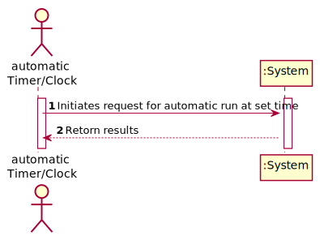
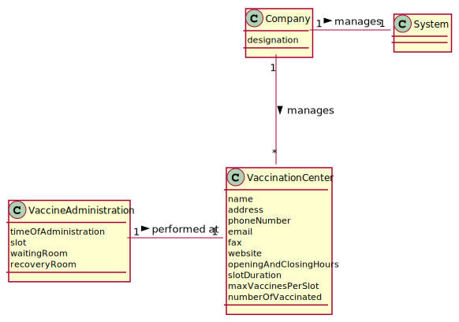
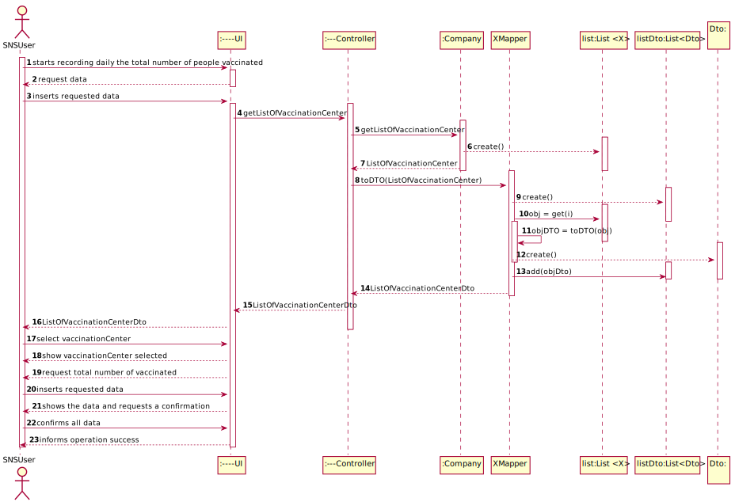

## 1. Engineering Requirements
In this section, it is suggested to capture the requirement description and specifications as provided by the client as well as any further clarification on it. It is also suggested to capture the requirements acceptance criteria and existing dependencies to other requirements. At last, identify the involved input and output data and depicted an Actor-System interaction in order to fulfill the requirement
### 1.1. User Story Description
DGS wants to record daily the total number of people vaccinated in each vaccination center.
- Acceptance criteria: The algorithm should run automatically at a time defined in a configuration file and should 
                       register the data, the name of the vaccination center and the total number of vaccination users.  
                

### 1.2. Specifications and Clarifications

#### 1.2.1. From the Specifications Document:

#### 1.2.2. From the client clarifications:

- Question:
  Dear client, In the acceptance criteria, "the algorithm should run automatically at a time defined in a configuration file and should register a date, the name of the vaccination center and the total number of vaccinated users." How it is supposed to register this information? Should it be recorded in a file (ex: txt,..) or recorded in the system (ex: in a store) ?
   - Answer:  The data should be written to a CSV file (field delimiter should be a semicolon)
- Question: As per the acceptance criteria, can the job be deployed manualy by a specific actor like Receptionist, Administrator,...? Who does the initial configuration for the automatic job? 
    - Answer: 
- Question: 
    - Answer:
- Question: 
    - Answer:
- Question: 
    - Answer:
- Question: 
    - Answer: 
- Question: 
    - Answer:  
- Question: 
    - Answer:
- Question: 
    - Answer:
- Question: 
    - Answer: 
- Question: 
    - Answer:

### 1.3. Acceptance Criteria

- The algorithm should run automatically at a time defined in a configuration file and should register the data, the 
  name, of the vaccination center and the total number of vaccination users.  

### 1.4. Found out Dependencies

- 
- 

### 1.5 Input and Output Data

*Identity here the data to be inputted by the system actor as well as the output data that the system have/needs to
present in order to properly support the actor actions. Regarding the inputted data, it is suggested to distinguish
between typed data and selected data (e.g. from a list)*

#### 1.5.1. Input Data

snsNumber
vaccinationCenter
data
time
vaccineType

#### 1.5.2. Output Data
Success of the operation

### 1.6. System Sequence Diagram (SSD)

### 1.7 Other Relevant Remarks

There are some similarities to US 2 regarding the need (i) schedule the vaccine (ii) to send an sms to the user.

## 2. OO Analysis

### 2.1. Relevant Domain Model Excerpt

### 2.2. Other Remarks

**Omitted / Not Provided.**

## 3. Design - User Story Realization

### 3.1. Rationale

| Interaction ID                                                             | Question: Which class is responsible for...       | Answer                           | Justification (with patterns)                       |
|:---------------------------------------------------------------------------|:--------------------------------------------------|:---------------------------------|:----------------------------------------------------|
| Step 1                                                                      |...scheduling the timer?                           |Company                           |IE: The company knows its own tasks                |
| Step 2                                                                      |...creating the timer	?                         |Company                           |IE: The task needs to know when it has to run      |
| Step 3 - The clock starts executing the task at the set time                |...trigger the run of the task?                    |Timer                             |IE: Knows its own schedule                         |
| Step 4 - The system checks and records all confirmed vaccines to be sorted automatically                                        |                                  |                                                   |
| Step 5 - The system sorts and lists all records according to the defined criteria, saving the results                           |                                  |                                                   |
| Step 6 - The system saves the results sorted by date, place and total number of vaccinated.                                     |					                 |                                                   |
| Step 7 - Process 5 and 6 are repeated until there are no more records to be collected                                           |                                  |                                                   |

According to the taken rationale, the conceptual classes promoted to software classes are:
* Company
* ScheduleVaccine

Other software classes (i.e. Pure Fabrication) identified:

* ScheduleVaccineUI
* ScheduleVaccineController
* ScheduleVaccineStore
* ScheduleVaccineDto
* **SMSNotification**

Other software classes of external systems/components:

* AuthFacade

## 3.2. Sequence Diagram (SD)

## 3.3. Class Diagram (CD)

# 4. Tests

In this section, it is suggested to systematize how the tests were designed to allow a correct measurement of
requirements fulfilling.

**Test 1:** Check that it is not possible to create an instance of the Example class with null values.

	@Test(expected = IllegalArgumentException.class)
		public void ensureNullIsNotAllowed() {
		Exemplo instance = new Exemplo(null, null);
	}

# 5. Construction (Implementation)

# 6. Integration and Demo

In this section, it is suggested to describe the efforts made to integrate this functionality with the other features
of the system.

# 7. Observations

In this section, it is suggested to present a critical perspective on the developed work, pointing, for example, to
other alternatives and or future related work.
