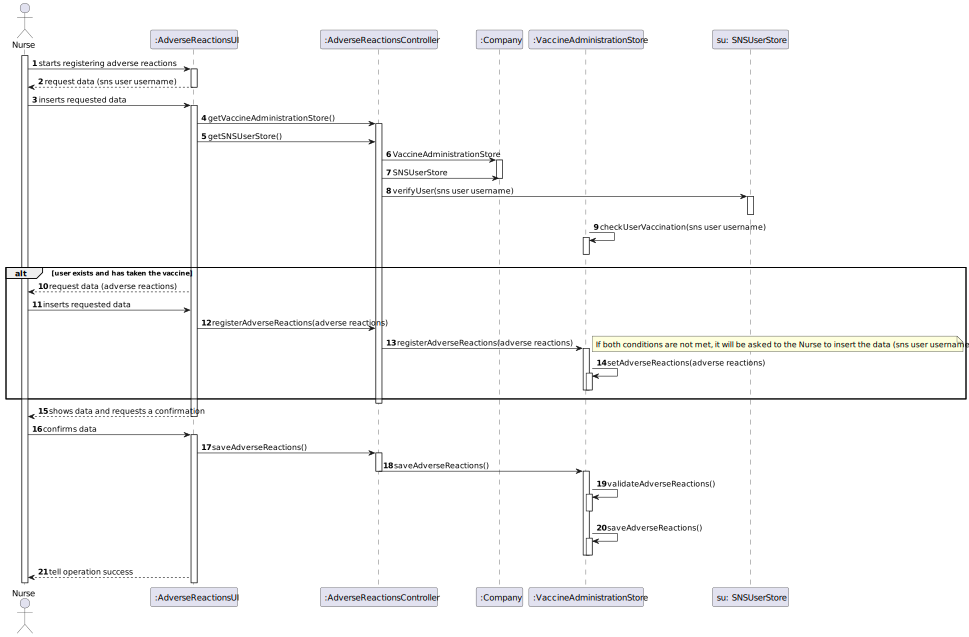

# US 7 - Register the adverse reactions of a SNS User

## 1. Requirements Engineering

*In this section, it is suggested to capture the requirement description and specifications as provided by the client as well as any further clarification on it. It is also suggested to capture the requirements acceptance criteria and existing dependencies to other requirements. At last, identify the involved input and output data and depicted an Actor-System interaction in order to fulfill the requirement.*

### 1.1. User Story Description

*As a nurse, I intend to record adverse reactions of a SNS User.*

### 1.2. Customer Specifications and Clarifications
From the Specifications Document:
- "If the nurse identifies any adverse reactions during that recovery period, the nurse should record the adverse reactions in the system."

From the client clarifications:
- Question: "When recording adverse reactions, does the Nurse need to folllow a form? If so, what are its attributes?"
- Answer: The nurse does not need to fill a form. The nurse only writes a text with at most 300 characters.
- Question: "in this US (07) , the registration of adverse reactions is simply by indicating the sns user that received the shot or we need to register the adverse reactions by sns user arrival time? By this, i meant, that the nurse registers sns user's adverse reaction by order of arrival, automatically, or the system is manual, like she/he needs to indicate the name and etc? "
- Answer: The nurse identifies adverse reactions during the recovery period. But the nurse can register the adverse reactions whenever she wants.
- Question: "1 Question: The SNS User will record the reactions or it's only the nurse? 2 Question : The Nurse must select one SNS User and then write the reactions of that SNS User? 3 Question : When the Nurse will record those reactions? "
- Answer: If the nurse identifies any adverse reactions during that recovery period, the nurse should record the adverse reactions in the system. The nurse must enter the user's SNS number and must describe the adverse reactions.
- Question: "What are the requirements for a sns user's adverse reactions to be recorded? Is it only necessary to confirm the existence of the chosen sns user or there's something else?"
- Answer: If the nurse identifies any adverse reactions during that recovery period, the nurse should record the adverse reactions in the system. The nurse must enter the user's SNS number and must describe the adverse reactions
- Question: " 1- Should the adverse reactions only be recorded on the program, on a text file in a computer folder, or both? 2- And if the SNS User that the nurse intends to record an adverse reaction isn't in the recovery room, should the system notify her about that issue?"
- Answer: 1 - The adverse reactions should not be recorded in a file. 2 - No.

### 1.3. Acceptance Criteria
- AC1: The user must be registered in the system
- AC2: The user must have taken the vaccine
- AC3. The adverse reactions cannot have more than 300 characters

### 1.4. Found out Dependencies
- US4
- US5
- US8
- US3
- US10
- US12
- US13
- US9

### 1.5 Input and Output Data

*Identity here the data to be inputted by the system actor as well as the output data that the system have/needs to present in order to properly support the actor actions. Regarding the inputted data, it is suggested to distinguish between typed data and selected data (e.g. from a list)*
- Typed data: sns user and adverse reactions
- Selected data: sns user and adverse reactions
- Output data: (In)Sucess of the operation performed

### 1.6. System Sequence Diagram (SSD)

### 1.7 Other Relevant Remarks

*Use this section to capture other relevant information that is related with this US such as (i) special requirements ; (ii) data and/or technology variations; (iii) how often this US is held.*

## 2. OO Analysis

### 2.1. Relevant Domain Model Excerpt
*In this section, it is suggested to present an excerpt of the domain model that is seen as relevant to fulfill this requirement.*

### 2.2. Other Remarks

*Use this section to capture some aditional notes/remarks that must be taken into consideration into the design activity. In some case, it might be usefull to add other analysis artifacts (e.g. activity or state diagrams).*

## 3. Design - User Story Realization

### 3.1. Rationale

**The rationale grounds on the SSD interactions and the identified input/output data.**

| Interaction ID                                               | Question: Which class is responsible for...                            | Answer                     | Justification (with patterns)                                |
|:-------------------------------------------------------------|:-----------------------------------------------------------------------|:---------------------------|:-------------------------------------------------------------|
| Step 1 - starts recording adverse reactions of a SNS User 		 | 	Communicating with the user						                                     | AdverseReactionsUI         | IE: responsible for communicating with the user              |
| Step 2 - request data (sns user username)	                   | 	Requesting data to the user						                                     | AdverseReactionsUI         | IE                                                           |
| Step 3 - types requested data		                              | Validating SNS User existence					                                     | SNSUserStore               | IE: knows all of the SNSUser objects                         |
| Step 4 - request data (adverse reactions)	                   | 	Validating if the SNS User has been vaccinated						                  | VaccineAdministrationStore | IE: knows every SNS user that has been vaccinated            |
| Step 5 - types requested data		                              | Requesting data to the user					                                       | AdverseReactionsUI         | IE: responsible for communicating with the user              |
| Step 6 - shows the data and requests a confirmation  		      | 	Validating the data locally	(eg: mandatory vs non-mandatory data)				 | VaccineAdministrationStore | IE: knows its own data                                       |
| 	                                                            | 	Validating the data globally (eg: duplicated data)						              | VaccineAdministrationStore | IE: knows all the sns users that have been vaccinated        |
| Step 7 - confirms data                                       | 	Saving the created adverse reactions					                             | VaccineAdministrationStore | IE: records all the adverse reactions to a specific SNS User |
| Step 8 - informs operation success                           | 	Informing the operation success						                                 | AdverseReactionsUI         | IE: responsible for communicating with the user              |              

### Systematization ##

According to the taken rationale, the conceptual classes promoted to software classes are:
* 

Other software classes (i.e. Pure Fabrication) identified:
* 

## 3.2. Sequence Diagram (SD)

*In this section, it is suggested to present an UML dynamic view stating the sequence of domain related software objects' interactions that allows to fulfill the requirement.*

## 3.3. Class Diagram (CD)

*In this section, it is suggested to present an UML static view representing the main domain related software classes that are involved in fulfilling the requirement as well as and their relations, attributes and methods.*

# 4. Tests
*In this section, it is suggested to systematize how the tests were designed to allow a correct measurement of requirements fulfilling.*

**_DO NOT COPY ALL DEVELOPED TESTS HERE_**

**Test 1:** Check if a user is registered in the system and if it has taken a vaccine. (Controller)

       @Test
    void checkUserExistence() {
        AdverseReactionsController ar = new AdverseReactionsController();
        int snsnumber = 123456788;
        ar.checkUserExistence(snsnumber);
    }

**Test 2:** Add adverse reactions to a vaccine administration related to an SNS User (Controller)
        
    @Test
    void addAdverseReactions() {
        AdverseReactionsController ar = new AdverseReactionsController();
        int snsnumber = 123456788;
        String adverseReactions = "Headache and stomach dilatation";
        ar.addAdverseReactions(snsnumber,adverseReactions);
    }
    
**Test 3:** Check user existence

    @Test
    void checkUserExistence() {
        User user = new User("Tiago","MASCULINE","10/12/2010","Rua nova",967654321,"tiago@gmail.com",123456789,98765431);
        User user2 = new User("João","MASCULINE","10/12/2010","Rua nova",967654321,"joao@gmail.com",123456789,98765431);
        VaccinationCenter vc = new VaccinationCenter("centro1","rua1",123456789,"email1",123456789,"website1",12,13,14,15);
        LocalDateTime now = LocalDateTime.now();
        LocalDateTime localDateTime1 = LocalDateTime.of(2022, 06, 24, 14, 33, 48, 123456789);
        UserEntry userEntry = new UserEntry(user2,now,localDateTime1,vc);
        UserEntry userEntry1 = new UserEntry(user,now,localDateTime1,vc);
        Company c = new Company();
        c.userEntryList.add(userEntry);
        c.userEntryList.add(userEntry1);
        c.chooseUserAndVaccine(1, Vaccines.vacine.BioNtech,"12cd-12",2,"");
        c.checkUserExistence(123456789);
        boolean check = true;
        boolean check2 = false;
        assertEquals(check,c.checkUserExistence(123456789));
        assertEquals(check2,c.checkUserExistence(123333333)); 
    }

**Test 4:** Add adverse reactions to an SNS User

    @Test
    void addAdverseReactions() {
        User user = new User("Tiago","MASCULINE","10/12/2010","Rua nova",967654321,"tiago@gmail.com",123456789,98765431);
        User user2 = new User("João","MASCULINE","10/12/2010","Rua nova",967654321,"joao@gmail.com",123456789,98765431);
        VaccinationCenter vc = new VaccinationCenter("centro1","rua1",123456789,"email1",123456789,"website1",12,13,14,15);
        LocalDateTime now = LocalDateTime.now();
        LocalDateTime localDateTime1 = LocalDateTime.of(2022, 06, 24, 14, 33, 48, 123456789);
        UserEntry userEntry = new UserEntry(user2,now,localDateTime1,vc);
        UserEntry userEntry1 = new UserEntry(user,now,localDateTime1,vc);
        Company c = new Company();
        c.userEntryList.add(userEntry);
        c.userEntryList.add(userEntry1);
        c.chooseUserAndVaccine(1, Vaccines.vacine.BioNtech,"12cd-12",2,"");
        c.checkUserExistence(123456789);
        boolean check = true;
        boolean check2 = false;
        assertEquals(check,c.checkUserExistence(123456789));
        assertEquals(check2,c.checkUserExistence(123333333));
        String adverseReactions = "Headache";
        c.addAdverseReactions(123456789,adverseReactions);
    }
    

*It is also recommended to organize this content by subsections.*

# 5. Construction (Implementation)

**Method that checks User Existence:**

    public boolean checkUserExistence(int snsnumber) {
        boolean check = false;
        for (VaccineAdministration ue : vaccineAdministrationsList) {
            if (ue.getSnsUserNumber() == snsnumber) {
                check = true;
            }
        return check;
    }}

**Method that adds the Adverse Reactions to a vaccine administration of an SNS User:**
    
    public void addAdverseReactions(int snsnumber, String adverseReactions) {

        for (int i = 0; i < vaccineAdministrationsList.size(); i++) {
            if (vaccineAdministrationsList.get(i).getSnsUserNumber() == snsnumber) {
                vaccineAdministrationsList.get(i).setAdverseReactions(adverseReactions);
            }
        }
        for (VaccineAdministration ue: vaccineAdministrationsList){
            System.out.println(ue);
        }
    }

# 6. Integration and Demo

*In this section, it is suggested to describe the efforts made to integrate this functionality with the other features of the system.*

- **It was needed to finnish the US8 before working on  this US, because for a user to have the adverse reactions he needs to have taken a vaccine**

# 7. Observations

*In this section, it is suggested to present a critical perspective on the developed work, pointing, for example, to other alternatives and or future related work.*