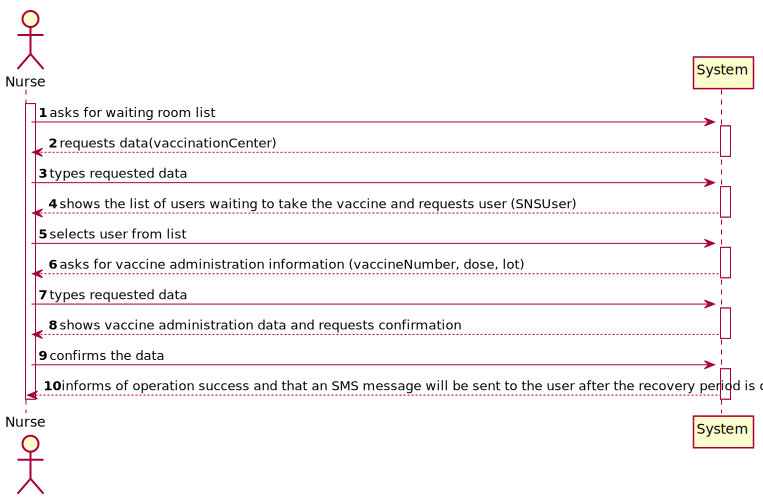
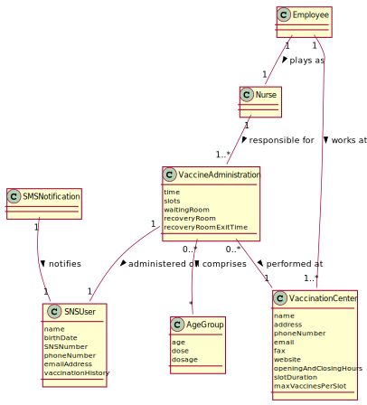
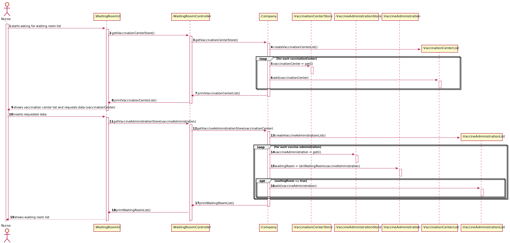
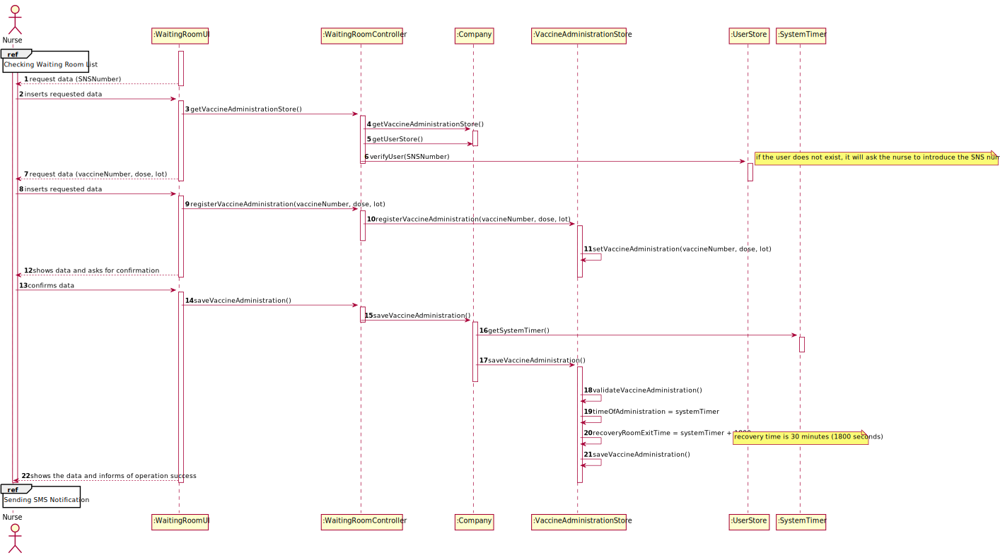
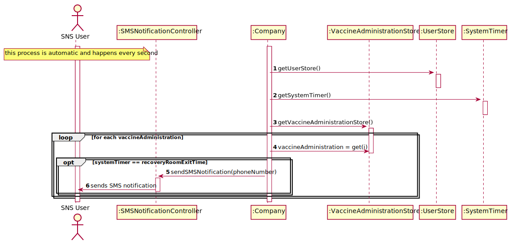
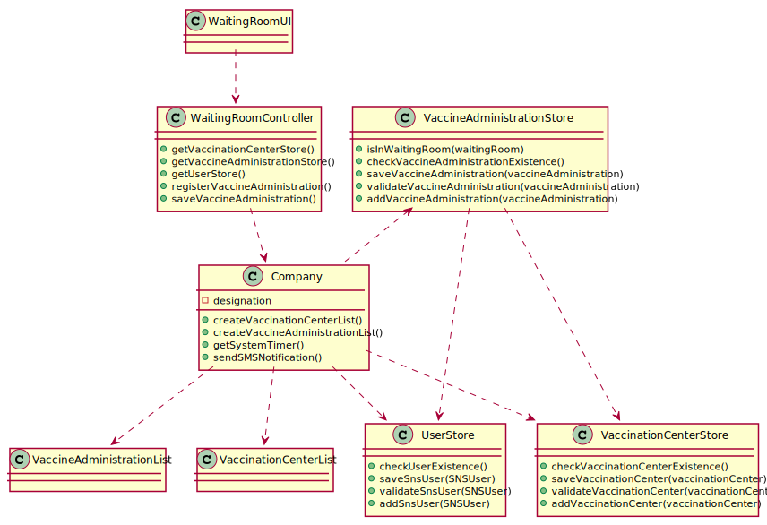

# US8 - Recording the Vaccine Administration

## 1. Engineering Requirements

In this section, it is suggested to capture the requirement description and specifications as provided by the client as well as any further clarification on it. It is also suggested to capture the requirements acceptance criteria and existing dependencies to other requirements. At last, identify the involved input and output data and depicted an Actor-System interaction in order to fulfill the requirement

### 1.1. User Story Description

As a nurse, I want to record the administration of a vaccine to an SNS user. At the end of the recovery period, the user should receive an SMS message informing the SNS user that he can leave the vaccination center.

### 1.2. Specifications and Clarifications

#### 1.2.1. From the Specifications Document:

- " [...] At any time, a nurse responsible for administering the vaccine will use the application to check the list of SNS users that are present in the vaccination center to take the vaccine and will call one SNS user to administer him/her the vaccine. [...]"
- " [...] The nurse checks the user info and health conditions in the system and in accordance with the scheduled vaccine type, and the SNS user vaccination history, (s)he gets system instructions regarding the vaccine to be administered (e.g.: vaccine and respective dosage considering the SNS user age group). After giving the vaccine to the user, each nurse registers the event in the system, more precisely, registers the vaccine type (e.g.: Covid-19), vaccine name/brand (e.g.: Astra Zeneca, Moderna, Pfizer), and the lot number used. Afterwards, the nurse sends the user to a recovery room, to stay there for a given recovery period (e.g.: 30 minutes). If there are no problems, after the given recovery period, the user should leave the vaccination center. The system should be able to notify (e.g.: SMS or email) the user that his/her recovery period has ended. [...]"

#### 1.2.2. From the client clarifications:

- The nurse selects an SNS user from a list, checks user's Name, Age and Adverse Reactions registered in the system and registers information about the administered vaccine.
- If it is the first dose, the application should show the list of possible vaccines to be administered. If is is not a single dose vaccine, when the SNS user arrives to take the vaccine, the system should simply show the dose and the respective dosage.
- A vaccine is associated with a given vaccine type. Therefore, there is no need to register the vaccine type. Moreover, the nurse should also register the vaccine lot number (the lot number has five alphanumeric characters an hyphen and two numerical characters (example: 21C16-05)).
- A SNS user is fully vaccinated when he receives all doses of a given vaccine.
- A SNS user that has received a single-dose vaccine is considered fully vaccinated and will not take more doses.
- A SNS user that is fully vaccinated will not be able to schedule a new vaccine of the type for which he is already fully vaccinated.

### 1.3. Acceptance Criteria

- The nurse should select a vaccine and the administered dose number. 

### 1.4. Found out Dependencies

- US4
- US5
- US3
- US10
- US12
- US13
- US9

### 1.5 Input and Output Data

*Identify here the data to be inputted by the system actor as well as the output data that the system have/needs to present in order to properly support the actor actions. Regarding the inputted data, it is suggested to distinguish between typed data and selected data (e.g. from a list)*

#### 1.5.1. Input Data

* vaccinationCenter
* snsUserNumber
* vaccineNumber
* dose
* lot

#### 1.5.2. Output Data

* printVaccinationCenterList()
* printWaitingRoomList()
* sendSMSNotification()

### 1.6. System Sequence Diagram (SSD)

### 1.7 Other Relevant Remarks

**Omitted / Not Provided.**

## 2. OO Analysis

### 2.1. Relevant Domain Model Excerpt

### 2.2. Other Remarks

**Omitted / Not Provided.**

## 3. Design - User Story Realization

### 3.1. Rationale

| Interaction ID                                                                                                               | Question: Which class is responsible for...                        | Answer                          | Justification (with patterns)                                                        |
|:-----------------------------------------------------------------------------------------------------------------------------|:-------------------------------------------------------------------|:--------------------------------|:-------------------------------------------------------------------------------------|
| Step 1 - starts asking for the list of users in a vaccination center's waiting room. 		                                      | 	Communicating with the user?						                                | VaccineAdministrationUI         | IE: The UI is responsible for communicating with the user.                           |
| Step 2 - request data (Vaccination Center)                                                                                   | 	Requesting data to the user?						                                | VaccineAdministrationUI         | IE: The UI is responsible for requesting input data from the user.                   |
| Step 3 - types requested data		                                                                                              | Validating Vaccination Center existence?					                      | VaccinationCentreStore          | IE: knows all of the VaccinationCentre objects                                       |
| Step 4 - shows the list of users waiting to take the vaccine and requests user (SNSUser)	                                    | 	Having the Waiting Room list?				                                 | UserEntryStore                  | IE: knows all SNS Users in a waiting room of a vaccination centre.                   | 	                      
| Step 5 - selects user from list					                                                                                         | Receiving the SNS User and selecting it from the list              | UserEntryStore                  | IE: knows all SNS Users in a waiting room of a vaccination centre.                   | 
| Step 6 - asks for vaccine administration information (vaccineNumber, dose, lot)				                                          | Passing the information to the method that chooses the information | VaccineAdministrationController | Pure Fabrication                                                                     | 
| Step 7 - types requested data				                                                                                            | Validating the information received (locally)                      | VaccineAdministration           | IE: The VaccineAdministration has all validations for the checking the data inserted | 
| Step 8 - shows vaccine administration data and requests confirmation				                                                     | Validating the information received  (globally)                    | VaccineAdministrationStore      | IE: The Store knows all objects of the VaccineAdministration                         | 
| Step 9 - confirms the data			                                                                                                | Saving the data received                                           | VaccineAdministrationStore      | IE: The store has a list to store the VaccineAdministration objects.                 | 
| Step 10 - informs of operation success and that an SMS message will be sent to the user after the recovery period is over			 | Communicating with the user telling operation success              | VaccineAdministrationUI         | IE: The UI is responsible for communicating with the user.                           |
| Step 11 - informs of operation success and that an SMS message will be sent to the user after the recovery period is over			 | Sending the user an SMS notification                               | SMSNotificationController       | Pure Fabrication                                                                     |

According to the taken rationale, the conceptual classes promoted to software classes are:

* SNS User
* Vaccine Administration
* Vaccination Center

Other software classes (i.e. Pure Fabrication) identified:

## 3.2. Sequence Diagram (SD)

## 3.3. Class Diagram (CD)

# 4. Tests

In this section, it is suggested to systematize how the tests were designed to allow a correct measurement of requirements fulfilling.

**Test 1:** Check that it is not possible to create an instance of the Example class with null values.

	@Test(expected = IllegalArgumentException.class)
		public void ensureNullIsNotAllowed() {
		Exemplo instance = new Exemplo(null, null);
	}

# 5. Construction (Implementation)

# 6. Integration and Demo

In this section, it is suggested to describe the efforts made to integrate this functionality with the other features of the system.

# 7. Observations

In this section, it is suggested to present a critical perspective on the developed work, pointing, for example, to other alternatives and or future related work.
